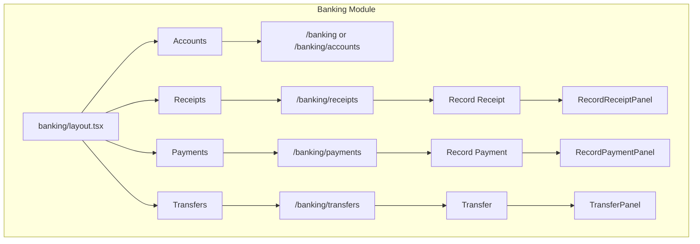
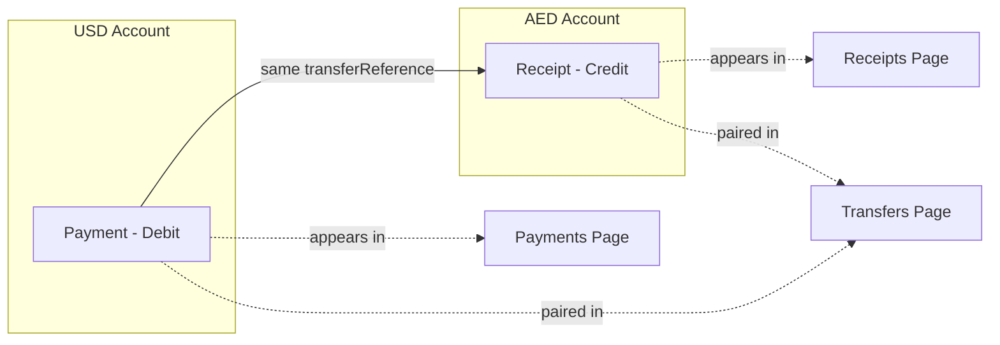
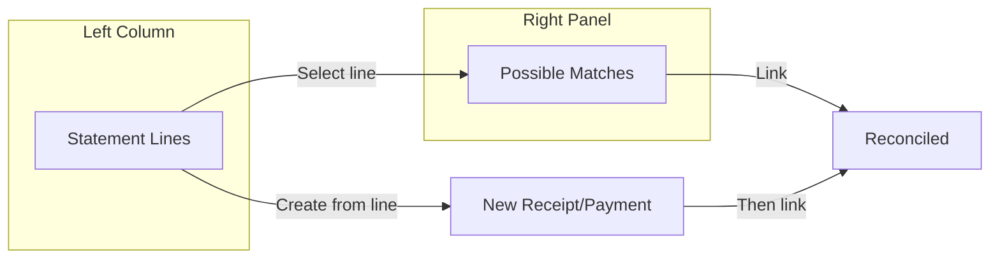

---
consolidatedFrom:
  - banking_pill_nav_and_panels_1ed34d4c.plan.md
  - banking-and-dashboard-pill-review-e04b65.md
  - sales_mini_dashboard_pill_4a336188.plan.md
category: modules
---

# Banking & Dashboard Pills

Consolidated from: Banking Pill Nav and Panels, Banking and Dashboard Pill Review, Sales Mini Dashboard Pill.

---

# Part I: Banking Module

## 1.1 Current State

- **Banking**: Single page at `src/app/(dashboard)/banking/page.tsx` with stats, bank account tabs, transactions table, and "Import Statement" button.
- **Sales pattern**: Layout with pills (Invoices, Customers, Payments Received, Statements); each child page has search + primary action button (e.g. "New Invoice").

## 1.2 Target Structure



---

## 1.3 Pill Nav & Layout

**Create** `src/app/(dashboard)/banking/layout.tsx`

- Mirror `sales/layout.tsx` pattern.
- **Pills**: Accounts | Receipts | Payments | Inter-account Transfers
- Icons: `Landmark`, `ArrowDownLeft` (receipts), `ArrowUpRight` (payments), `ArrowLeftRight` (transfers)
- Title + pills inline; active pill: `bg-text-primary text-white`
- Breadcrumbs: Workspaces > Banking > [page title]

---

## 1.4 Restructure Pages

**Move current content** from `banking/page.tsx` to `banking/accounts/page.tsx` (or keep at `/banking` with redirect logic).

- **/banking** (or `/banking/accounts`): Bank reconciliation (2-column screen) + stats. See **Section 1.5: Bank Reconciliation** below. Remove Breadcrumbs/PageHeader (handled by layout).
- **/banking/receipts**: New page—list of receipts (payments received), search, "Record Receipt" button.
- **/banking/payments**: New page—list of payments made, search, "Record Payment" button.
- **/banking/transfers**: New page—list of inter-account transfers, "Transfer" button.

Routing choice: Use `/banking` for Accounts (default) and `/banking/receipts`, `/banking/payments`, `/banking/transfers` for sub-pages. Layout shows all 4 pills; clicking Accounts goes to `/banking`.

---

## 1.5 Domain Definitions

**Receipts** = All credit entries in the bank (money IN). Includes:

- Customer payments (allocate to invoices)
- Owner's deposit
- Payment refunds (from suppliers)

**Payments** = All debit entries in the bank (money OUT). Includes:

- Supplier payments (allocate to bills)
- Owner's withdrawal
- Refunds to customers

Both lists are bank-centric: `bankTransactions` with `type = 'credit'` (receipts) or `type = 'debit'` (payments), whether imported from statements or manually entered.

**Inter-account Transfers** = A **view** of entries that are part of inter-account transfers. These are the **same** transactions that appear in Receipts and Payments:

- Example: Transfer from USD account to AED account:
  - **AED account**: Receipt (credit) — "Transfer from USD" — appears in **Receipts** and is **marked** for Inter-account Transfers
  - **USD account**: Payment (debit) — "Transfer to AED" — appears in **Payments** and is **marked** for Inter-account Transfers
  - **Inter-account Transfers page**: Shows the pair as one row: Date | From (USD) | To (AED) | Amount | Reference

So transfers are not a separate record type; they are receipt + payment pairs linked by a common `transferReference`. The two `bankTransactions` appear in their respective Receipts/Payments lists with an indicator, and the Transfers page displays the paired view.



---

## 1.6 APIs

### Receipts (all credits)

- **GET** `/api/banking/receipts` — List `bankTransactions` where `type = 'credit'` (optionally filter by `bankAccountId`). Include linked `payment` and entity info when applicable (customer/supplier for refunds). Include `isInterAccountTransfer` flag so UI can show a badge on transfer entries (e.g. "From USD account"). Merge imported statement credits + manually recorded receipts.
- **POST** `/api/banking/receipts` — Create receipt. Body: `{ receiptType, date, bankAccountId, amount, description?, customerId?, allocations?, supplierId?, ... }`.
  - **Customer Payment**: Create `payment` (paymentType=received), allocations, update invoices, journal entry, and **bank transaction** (type=credit).
  - **Owner's Deposit**: Create `bankTransaction` (type=credit) + journal entry (dr. bank, cr. owner's equity/drawings reversal or designated account).
  - **Refund Received**: Create `payment` (paymentType=received, entityType=supplier) + optional allocation to bill credit, journal entry, `bankTransaction` (type=credit).

### Payments (all debits)

- **GET** `/api/banking/payments` — List `bankTransactions` where `type = 'debit'`. Include linked `payment` and entity info when applicable. Include `isInterAccountTransfer` flag so UI can show a badge on transfer entries.
- **POST** `/api/banking/payments` — Create payment. Body: `{ paymentType, date, bankAccountId, amount, description?, supplierId?, allocations?, customerId?, ... }`.
  - **Supplier Payment**: Create `payment` (paymentType=made), allocations, update bills, journal entry, **bank transaction** (type=debit).
  - **Owner's Withdrawal**: Create `bankTransaction` (type=debit) + journal entry (dr. owner's equity/drawings, cr. bank).
  - **Refund to Customer**: Create `payment` (paymentType=made, entityType=customer) + optional allocation to invoice credit, journal entry, `bankTransaction` (type=debit).

### Transfers (paired view)

- **GET** `/api/banking/transfers` — Return **paired** transactions: find `bankTransactions` where `category = 'inter_account_transfer'` and `transferReference` (or similar) matches. Group by pair: each row = one transfer with From Account, To Account, Amount, Date, Reference. The underlying debit and credit stay in `bankTransactions` and appear in Payments/Receipts respectively.
- **POST** `/api/banking/transfers` — Create transfer:
  - Generate a unique `transferReference` (e.g. `TRF-2026-001`).
  - Insert two `bankTransactions`:
    - Debit on from-account (USD): `description = "Transfer to AED"`, `category = 'inter_account_transfer'`, `reference = transferReference`
    - Credit on to-account (AED): `description = "Transfer from USD"`, `category = 'inter_account_transfer'`, `reference = transferReference`
  - Update `currentBalance` on both `bankAccounts`.
  - Optionally create a journal entry (dr. to-account GL, cr. from-account GL) for GL accuracy.

**Note**: `payments` and `bankTransactions` schema already exist. Add `transferReference` (varchar, nullable) to `bankTransactions` to link pairs. When both debit and credit share the same `transferReference`, they form a transfer pair. Manually recorded receipts/payments must create `bankTransactions` so they appear in the bank-centric lists.

---

## 1.7 Panels

### RecordReceiptPanel

**Create** `src/components/modals/record-receipt-panel.tsx`

- EntityPanel pattern (like CreateInvoicePanel).
- **Receipt type selector**: Customer Payment | Owner's Deposit | Refund Received
- Common fields: Date, Bank Account (SearchableSelect from `/api/banking`), Amount, Reference/Notes.
- **Customer Payment**: Customer (ContactSelect), Allocations to unpaid invoices (reuse UX from VerifyReceiptForm).
- **Owner's Deposit**: Description (e.g. "Capital injection").
- **Refund Received**: Supplier (ContactSelect), optional allocation to bill/credit note; Description.
- Calls `POST /api/banking/receipts` with `receiptType` and type-specific fields.
- Fetches customers, suppliers, unpaid invoices from existing APIs.

### RecordPaymentPanel (Banking)

**Create** `src/components/modals/record-payment-banking-panel.tsx`

- EntityPanel pattern.
- **Payment type selector**: Supplier Payment | Owner's Withdrawal | Refund to Customer
- Common fields: Date, Bank Account, Amount, Reference/Notes.
- **Supplier Payment**: Supplier (ContactSelect), Allocations to unpaid bills.
- **Owner's Withdrawal**: Description (e.g. "Drawings").
- **Refund to Customer**: Customer (ContactSelect), optional allocation to invoice/credit note; Description.
- Calls `POST /api/banking/payments` with `paymentType` and type-specific fields.
- Fetches suppliers, customers, unpaid bills from existing APIs.

### TransferPanel

**Create** `src/components/modals/transfer-panel.tsx`

- Fields: From Account, To Account (same org, exclude same account), Amount, Date, Reference.
- Calls `POST /api/banking/transfers`.
- Fetches bank accounts from `/api/banking`.

---

## 1.8 Page Implementations

### Receipts page

- Search input, "Record Receipt" button (opens RecordReceiptPanel).
- Table: Date, Bank Account, Type (Customer Payment | Owner's Deposit | Refund | **Inter-account**), Entity (customer/supplier or "From X account" for transfers or "—"), Amount, Reference.
- Show badge/indicator for rows where `isInterAccountTransfer === true` (e.g. "Inter-account" or "From USD").
- Fetch from `GET /api/banking/receipts`; empty state when no data.
- Click row to open detail overlay (optional).

### Payments page

- Search input, "Record Payment" button (opens RecordPaymentPanel).
- Table: Date, Bank Account, Type (Supplier Payment | Owner's Withdrawal | Refund | **Inter-account**), Entity, Amount, Reference.
- Show badge/indicator for rows where `isInterAccountTransfer === true` (e.g. "Inter-account" or "To AED").
- Fetch from `GET /api/banking/payments`; empty state when no data.

### Transfers page

- "Transfer" button (opens TransferPanel).
- Table: Date, From Account, To Account, Amount, Reference.
- Each row represents a **paired** transfer (the receipt in destination + payment in source). Fetch from `GET /api/banking/transfers`.
- Empty state when no transfers.

---

## 1.9 Bank Reconciliation

### Concept

A 2-column screen where users match **bank statement lines** (left) to **manually recorded entries** (right). Statement uploads do **not** auto-create transactions; users reconcile by linking or by creating new records from statement lines.



### Data Model (New)

- **bank_statements**: `id`, `bankAccountId`, `organizationId`, `uploadedAt`, `fileName`, `s3Key` (or file ref), `status`
- **bank_statement_lines**: `id`, `bankStatementId`, `transactionDate`, `description`, `amount`, `type` (credit/debit), `reference`, `matchedBankTransactionId` (nullable), `reconciledAt` (nullable), `lineOrder`

**Important**: Statement import no longer creates `bankTransactions`. It creates `bank_statements` + `bank_statement_lines` only.

### 2-Column Layout

**Left column**: Uploaded bank statement lines

- Bank account selector (or use selected account from context)
- "Upload Statement" button — upload CSV/PDF, parse into `bank_statement_lines`
- Table: Date | Description | Amount | Type | Status (Matched / Unmatched)
- Click a row to select it → right panel shows possible matches
- Actions per line: "Create receipt from line" | "Create payment from line" → opens RecordReceiptPanel / RecordPaymentPanel pre-filled from statement line; after save, user can link

**Right panel**: Possible matching results (when a statement line is selected)

- Fetch unreconciled manual entries (receipts for credit lines, payments for debit lines) for that bank account
- Rank by: amount match, date proximity, description similarity (configurable thresholds)
- Display: Date | Description | Amount | Type (Customer Payment, etc.) | Match score
- Actions: "Link" (match this statement line to this entry) | "Create new" (if no good match)
- When linking: **Link** = set `matchedBankTransactionId` on statement_line, mark both as reconciled. The statement line stays as statement line; our bankTransaction stays as is. We record the link.

### Two-Step Process per Match

1. **Bank reconciliation**: Link statement line ↔ our entry (receipt/payment/transfer). Both marked reconciled.
2. **GL categorization**: If our entry is not yet categorized (e.g. owner deposit), or for statement-created entries, user categorizes to GL account (reuse existing Suggest/Apply flow).

### Unmatched Statement Lines

- **Option A**: "Create receipt" or "Create payment" from line → creates our manual entry (bankTransaction + optional payment), pre-filled with date, amount, description. User completes details, saves. Then link.
- **Option B**: Leave as unidentified/unreconciled for later review.

### Matching Logic (Configurable)

- **Amount**: Exact or within tolerance (e.g. 0.01)
- **Date**: Within N days (e.g. ±3 days)
- **Description**: Fuzzy/similarity score (optional)
- Return candidates sorted by combined score. Expose config in settings or API params.

### Reconciliation APIs

- **POST** `/api/banking/statements/upload` — Upload file, parse, create `bank_statements` + `bank_statement_lines`. Does NOT create bankTransactions.
- **GET** `/api/banking/statements` — List statements for account; include line counts, reconciled counts.
- **GET** `/api/banking/statement-lines` — List lines for a statement (or account), with `matchedBankTransactionId` and reconciled status.
- **GET** `/api/banking/reconciliation/matches?statementLineId=...` — Get possible matches for a statement line. Query unreconciled receipts (if credit) or payments (if debit) for that bank account; rank by amount, date, description. Return with scores.
- **POST** `/api/banking/reconciliation/link` — Body: `{ statementLineId, bankTransactionId }`. Set `matchedBankTransactionId`, `reconciledAt` on statement line. Mark bankTransaction as reconciled.
- **POST** `/api/banking/reconciliation/create-from-line` — Body: `{ statementLineId, entryType: 'receipt'|'payment', ... }`. Create receipt or payment from statement line data, then optionally auto-link.

### Statement Upload vs Document Import

- **Banking reconciliation upload**: Creates `bank_statements` + `bank_statement_lines` only. No auto-creation of `bankTransactions`.
- **Document vault** (e.g. `/documents` with bank_statement type): Today may create `bankTransactions` via verify. Option: Redirect bank statement documents to Banking reconciliation, or use same statement tables and skip auto-creation. Scope TBD; Banking reconciliation is the primary path.

---

## 1.10 Schema

- **bank_statements** (new): `id`, `organizationId`, `bankAccountId`, `uploadedAt`, `fileName`, `s3Key`, `status`
- **bank_statement_lines** (new): `id`, `bankStatementId`, `transactionDate`, `description`, `amount`, `type` (credit/debit), `reference`, `matchedBankTransactionId` (nullable FK), `reconciledAt` (nullable), `lineOrder`
- **bankTransactions**:
  - `category` (existing varchar 50): Store `customer_payment`, `owner_deposit`, `refund_received`, `supplier_payment`, `owner_withdrawal`, `refund_to_customer`, `inter_account_transfer`.
  - Add `transferReference` (varchar 50, nullable): When set, this transaction is part of an inter-account transfer. Debit and credit of the same transfer share the same `transferReference`. Used to pair them for the Transfers view and to compute `isInterAccountTransfer` for Receipts/Payments lists.
- **Linked payments**: When receipt/payment is customer or supplier type, add `paymentId` on `bankTransactions` (nullable FK) for traceability.

---

## 1.11 Banking Quality Review

### What's Correct

- **Layout & navigation** (`banking/layout.tsx`): Clean pill nav with `usePathname` active-state logic, breadcrumbs, consistent with sales/purchases layouts.
- **All 4 pages** implemented: Accounts, Receipts, Payments, Transfers — each with search, table, loading/empty states.
- **All API routes** implemented: `receipts`, `payments`, `transfers`, `statements`, `statement-lines`, `statements/upload`, `reconciliation/matches`, `reconciliation/link`, `reconciliation/create-from-line`.
- **Modal panels**: Proper EntityPanel pattern, allocation logic, validation, API calls, reset-on-close.
- **Reconciliation** (`reconciliation-two-column.tsx`): Two-column layout, CSV upload, fuzzy matching (amount/date/description scoring), link & create-from-line flows.
- **Schema**: `bankTransactions`, `bankStatements`, `bankStatementLines` all properly defined with FK references and cascading deletes.

### Critical Gaps

| # | Issue | File(s) | Action |
|---|-------|---------|--------|
| 1 | **Missing DB migration** for `transfer_reference`, `payment_id` columns on `bank_transactions`, and the entire `bank_statements` / `bank_statement_lines` tables. Schema.ts defines them but no migration SQL exists. | `drizzle/` | Create migration `0004_add_banking_columns_and_tables.sql` with ALTER TABLE for new columns + CREATE TABLE for new tables. |
| 2 | **No database transaction wrapping** on multi-step writes. Receipts/payments API routes insert a payment, bank transaction, journal entry, journal lines, and update balances in separate queries — a failure mid-way leaves the DB inconsistent. | `api/banking/receipts/route.ts`, `api/banking/payments/route.ts`, `api/banking/transfers/route.ts` | Wrap all POST handlers in `db.transaction(async (tx) => { ... })`. |
| 3 | **`create-from-line` calls its own server via `fetch()`** to `api/banking/receipts` and `api/banking/payments`. This is fragile (requires constructing `baseUrl`, forwarding cookies, self-referencing). | `api/banking/reconciliation/create-from-line/route.ts` | Extract the receipt/payment creation logic into shared service functions and call them directly instead of HTTP round-tripping. |

### Quality Recommendations

| # | Issue | File(s) | Recommendation |
|---|-------|---------|----------------|
| 4 | **Hardcoded currency "AED"** in toast messages and panel UI. | `record-receipt-panel.tsx`, `record-payment-banking-panel.tsx`, `transfer-panel.tsx` | Read currency from selected bank account and pass to `formatNumber`. |
| 5 | **No optimistic loading or SWR/React Query** on banking pages — all 4 pages use raw `useEffect` + `fetch` + manual state. | `banking/page.tsx`, `receipts/page.tsx`, `payments/page.tsx`, `transfers/page.tsx` | Migrate to `useQuery` for consistency, automatic caching, and refetch-on-focus. |
| 6 | **`useEffect` dependency warning** — `bankAccountId` is used inside useEffect but not in the dependency array. | `record-receipt-panel.tsx:83`, `record-payment-banking-panel.tsx:83` | Add `bankAccountId` to deps or suppress with a ref pattern. |
| 7 | **N+1 query in statement-lines** — when fetching by `bankAccountId`, it loops over each statement and queries lines individually. | `api/banking/statement-lines/route.ts:64-83` | Use a single JOIN query: `bankStatementLines JOIN bankStatements WHERE bankAccountId = ?`. |
| 8 | **N+1 query in statements GET** — loops through statements and queries line counts one by one. | `api/banking/statements/route.ts:26-42` | Use a subquery or LEFT JOIN with GROUP BY. |
| 9 | **CSV parser is naive** — only handles comma-delimited, no quoted fields with commas, no multi-column debit/credit format (common in bank exports). | `api/banking/statements/upload/route.ts:7-46` | Use a proper CSV library (e.g., `papaparse`) and support common bank formats (separate debit/credit columns). |
| 10 | **Reconciliation matching loads ALL unreconciled transactions** into memory for scoring. Won't scale. | `api/banking/reconciliation/matches/route.ts:40-58` | Add SQL-level pre-filtering (amount range ±10%, date range ±30 days) before in-memory scoring. |
| 11 | **No pagination** on any banking list page (receipts, payments, transfers, statement lines). | All banking pages | Add cursor or offset pagination to both API and UI. |
| 12 | **Duplicate type definitions** — `BankAccount`, `Customer`, `Supplier`, `Allocation` types are copy-pasted across receipt and payment panels. | `record-receipt-panel.tsx`, `record-payment-banking-panel.tsx` | Extract shared types to `src/lib/banking/types.ts`. |
| 13 | **Transfer panel doesn't validate sufficient balance** before transferring. The API also doesn't check. | `transfer-panel.tsx`, `api/banking/transfers/route.ts` | Add balance check in API POST to prevent negative balances (if business rules require it). |

### Routing and Default View

- Top nav links to `/banking` → show Accounts (current reconciliation) by default.
- Pills: Accounts (href `/banking`), Receipts (`/banking/receipts`), Payments (`/banking/payments`), Transfers (`/banking/transfers`).
- `page.tsx` at `/banking` can either re-export the Accounts content or redirect to `/banking/accounts`; layout wraps all.

---

## 1.12 Banking File Summary

| Action | Path |
| ------ | ---- |
| Create | `src/app/(dashboard)/banking/layout.tsx` |
| Create | `src/app/(dashboard)/banking/accounts/page.tsx` — Bank reconciliation 2-column screen + stats |
| Modify | `src/app/(dashboard)/banking/page.tsx` → redirect or render Accounts content |
| Create | `src/app/(dashboard)/banking/receipts/page.tsx` |
| Create | `src/app/(dashboard)/banking/payments/page.tsx` |
| Create | `src/app/(dashboard)/banking/transfers/page.tsx` |
| Create | `src/app/api/banking/receipts/route.ts` (GET, POST) |
| Create | `src/app/api/banking/payments/route.ts` (GET, POST) |
| Create | `src/app/api/banking/transfers/route.ts` (GET, POST) |
| Create | `src/app/api/banking/statements/upload/route.ts` (POST) |
| Create | `src/app/api/banking/statements/route.ts` (GET) |
| Create | `src/app/api/banking/statement-lines/route.ts` (GET) |
| Create | `src/app/api/banking/reconciliation/matches/route.ts` (GET) |
| Create | `src/app/api/banking/reconciliation/link/route.ts` (POST) |
| Create | `src/app/api/banking/reconciliation/create-from-line/route.ts` (POST) |
| Create | `src/components/modals/record-receipt-panel.tsx` |
| Create | `src/components/modals/record-payment-banking-panel.tsx` |
| Create | `src/components/modals/transfer-panel.tsx` |
| Create | `src/components/banking/reconciliation-two-column.tsx` — Left: statement lines, Right: matches panel |
| Schema | Add `bank_statements`, `bank_statement_lines` tables; add `transferReference`, `paymentId` to `bankTransactions` |

---

# Part II: Dashboard Pill (Mini Dashboard Popover)

## 2.1 Architecture

```mermaid
flowchart TB
    subgraph pages [Pages with Dashboard Pill]
        Sales[Sales]
        Purchases[Purchases]
        Documents[Documents]
        Inventory[Inventory]
        Banking[Banking]
    end
    
    subgraph component [Shared Component]
        Pill[DashboardPill]
        Popover[Popover]
        Content[MiniDashboardContent]
        Customize[DashboardCustomizePanel]
        Prefs[useDashboardPillPreferences]
    end
    
    subgraph storage [Storage]
        LocalStorage[localStorage]
    end
    
    subgraph variants [Content by Path]
        SalesContent[Sales: Revenue, Invoices, Customers]
        PurchContent[Purchases: Expenses, Bills, Suppliers]
        DocContent[Documents: Pending, Verified, Recent]
        InvContent[Inventory: Items, Value, Low Stock]
        BankContent[Banking: Balance, Unreconciled, Txns]
    end
    
    subgraph api [APIs]
        Stats[/api/dashboard/stats]
        SalesAPI[/api/sales/mini-stats]
        PurchAPI[/api/purchases/mini-stats]
        DocAPI[/api/documents/mini-stats]
        InvAPI[/api/inventory/mini-stats]
        BankAPI[/api/banking/mini-stats]
    end
    
    Sales --> Pill
    Purchases --> Pill
    Documents --> Pill
    Inventory --> Pill
    Banking --> Pill
    
    Pill --> Popover
    Popover --> Content
    Content --> Customize
    Content --> Prefs
    Prefs --> LocalStorage
    Customize --> Prefs
    
    Content -->|path sales| SalesContent
    Content -->|path purchases| PurchContent
    Content -->|path documents| DocContent
    Content -->|path inventory| InvContent
    Content -->|path banking| BankContent
    
    SalesContent --> Stats
    SalesContent --> SalesAPI
    PurchContent --> Stats
    PurchContent --> PurchAPI
    DocContent --> Stats
    DocContent --> DocAPI
    InvContent --> Stats
    InvContent --> InvAPI
    BankContent --> Stats
    BankContent --> BankAPI
```

---

## 2.2 Composition Per Page

The Dashboard Pill renders **context-aware content** based on the current page. Each widget can be hidden by the user; preferences are persisted. All widgets below are included by default unless hidden.

### Sales — `/sales`, `/sales/*`

| Widget ID | Type | Description |
| --------- | ---- | ----------- |
| `metricsRow` | Metrics | Revenue, Outstanding, Overdue, Invoices |
| `avgInvoiceValue` | Metric | AED per invoice |
| `collectionRate` | Metric | Paid / Total as % |
| `yoyGrowth` | Metric | Revenue vs same period last year % |
| `barChart` | Bar | Monthly revenue (last 6 months) |
| `revenueTrend` | Line | Cumulative / rolling revenue trend |
| `pieChart` | Pie | Invoice status (draft/sent/paid/partial/overdue) |
| `topCustomers` | Table | Top 5 customers by revenue |
| `topProducts` | Table/Bar | Top products by revenue (from invoice lines) |
| `scatterChart` | Scatter | Invoice amount vs due date |

### Purchases — `/purchases`, `/purchases/*`

| Widget ID | Type | Description |
| --------- | ---- | ----------- |
| `metricsRow` | Metrics | Expenses, Outstanding, Paid, Bills |
| `avgBillValue` | Metric | AED per bill |
| `paymentRate` | Metric | Paid / Total as % |
| `upcomingPayables` | Metric | Bills due in 7 days / 30 days |
| `supplierCountTrend` | Metric/Sparkline | Supplier count change |
| `barChart` | Bar | Monthly expenses (last 6 months) |
| `pieChart` | Pie | Bill status breakdown |
| `topExpenseCategories` | Pie/Bar | By GL account from bill lines |
| `topSuppliers` | Table | Top 5 suppliers by total |

### Documents — `/documents`

| Widget ID | Type | Description |
| --------- | ---- | ----------- |
| `metricsRow` | Metrics | Pending, Verified, Flagged, Total |
| `successRate` | Metric | Verified / (Verified + Failed) % |
| `avgConfidence` | Metric | Mean AI confidence of processed docs |
| `oldestPending` | Metric | Age in days of oldest unprocessed doc |
| `barChart` | Bar | Documents processed per month |
| `processingByMonth` | Bar | Processed vs failed per month |
| `pieChart` | Pie | Document status |
| `documentsByType` | Pie | Invoice, receipt, bill, bank statement |
| `recentDocuments` | Table | 5 most recent documents |

### Inventory — `/inventory`

| Widget ID | Type | Description |
| --------- | ---- | ----------- |
| `metricsRow` | Metrics | Items, Products, Value, Low Stock |
| `reorderAlerts` | Metric | Items at or below reorder level |
| `stockOutRisk` | Metric | Items at 0 or negative stock |
| `inventoryTurnover` | Metric | COGS / avg inventory (if data exists) |
| `barChart` | Bar | Inventory value trend (last 6 months) |
| `pieChart` | Pie | Product vs Service split |
| `valueByCategory` | Pie/Bar | Value by category |
| `topItemsByValue` | Table | Top 5 items by value |
| `lowStockTable` | Table | Low stock items |

### Banking — `/banking`

| Widget ID | Type | Description |
| --------- | ---- | ----------- |
| `metricsRow` | Metrics | Balance, Unreconciled, Accounts |
| `reconciliationRate` | Metric | Reconciled / Total transactions % |
| `inVsOutThisMonth` | Dual metric | Incoming vs outgoing cash |
| `pendingAiMatches` | Metric | Transactions with AI suggestions |
| `barChart` | Bar | Cash flow (in/out) by month |
| `balanceTrend` | Line | Account balance over last 6 months |
| `pieChart` | Pie | Balance per bank account |
| `recentTransactions` | Table | 5 most recent transactions |
| `largestTransactions` | Table | Top 5 by amount |

---

## 2.3 User Preferences: Hide/Show Widgets

Users can hide any widget and save their preference. Preferences persist across sessions.

### Behavior

- **Customize button:** Gear/settings icon in the popover header opens a "Customize dashboard" panel
- **Widget toggles:** Each widget has a checkbox; unchecked = hidden
- **Save:** Changes apply immediately and persist to storage
- **Reset:** "Reset to default" restores all widgets visible

### Storage

- **Key:** `dashboard-pill-preferences` in `localStorage`
- **Shape:** `Record<variant, Record<widgetId, boolean>>` — e.g. `{ sales: { barChart: true, scatterChart: false }, purchases: { ... } }`
- **Optional later:** Add `user_preferences` table or `organizations.dashboardPillPreferences` JSONB for cross-device sync

### Implementation

- **Hook:** `useDashboardPillPreferences(variant)` — returns `{ visible, setVisible, reset }`
- **Component:** `DashboardWidget` wrapper — renders children only if `visible[widgetId] !== false`
- **Customize panel:** Inline in popover or small modal; list all widget IDs for current variant with checkboxes

---

## 2.4 Mini-Stats APIs

Each module gets a mini-stats endpoint returning chart-ready data. Existing `/api/dashboard/stats` provides aggregate metrics. Extend or add fields for the new widgets.

| Endpoint | Additional response fields (beyond base) |
| -------- | --------------------------------------- |
| **Sales** | `avgInvoiceValue`, `collectionRate`, `yoyGrowth`, `revenueTrend`, `topProducts`, `scatterData` |
| **Purchases** | `avgBillValue`, `paymentRate`, `upcomingPayables7d`, `upcomingPayables30d`, `supplierCountTrend`, `topExpenseCategories` |
| **Documents** | `successRate`, `avgConfidence`, `oldestPendingDays`, `processingByMonth`, `documentsByType` |
| **Inventory** | `reorderAlerts`, `stockOutRisk`, `turnover`, `valueByCategory`, `topItemsByValue` |
| **Banking** | `reconciliationRate`, `inVsOutThisMonth`, `pendingAiMatches`, `balanceTrend`, `largestTransactions` |

**Files to create:**

- `src/app/api/sales/mini-stats/route.ts`
- `src/app/api/purchases/mini-stats/route.ts`
- `src/app/api/documents/mini-stats/route.ts`
- `src/app/api/inventory/mini-stats/route.ts`
- `src/app/api/banking/mini-stats/route.ts`

---

## 2.5 Components

### MiniDashboardContent

**File:** `src/components/dashboard/dashboard-pill-content.tsx` (new)

Accepts `variant` prop: `"sales" | "purchases" | "documents" | "inventory" | "banking"`. Uses `usePathname()` if variant not passed.

**Layout:** ~450-550px wide, scrollable. Header: title + Customize (gear) icon. Each widget wrapped in `DashboardWidget` — renders only if `visible[widgetId]` is true.

**Widgets:** Render all widgets from section 2.2 for the current variant, wrapped with visibility check. Order: metrics row → extra metrics → bar/line charts → pie charts → tables → scatter (if any) → footer.

**Reuse:** IncomeChart, ForecastBarChart, ExpenseDonut. Add compact variants. Use Recharts for Line, Scatter, dual-series Bar.

### Supporting components

- **DashboardWidget** — Wrapper: `if (visible) return children; else return null`
- **DashboardCustomizePanel** — List of widget IDs with checkboxes, Reset button, uses `useDashboardPillPreferences`

### DashboardPill Component

**File:** `src/components/dashboard/dashboard-pill.tsx` (new)

- **Trigger:** Pill button (matches existing pill style: `rounded-full px-4 py-2`, icon + "Dashboard" label)
- **Container:** Radix `Popover` with `align="end"`, `side="bottom"`, large content area
- **Content:** Renders `MiniDashboardContent` with `variant` derived from `usePathname()` (e.g. `/sales` → `"sales"`)
- **Path mapping:** Match pathname prefix: `/sales`, `/sales/*` → sales; `/purchases`, `/purchases/*` → purchases; `/documents` → documents; `/inventory` → inventory; `/banking` → banking

---

## 2.6 Placement Across Pages

| Layout/Page | File | Placement |
| ----------- | ---- | --------- |
| Sales Layout | `src/app/(dashboard)/sales/layout.tsx` | Add DashboardPill as the first pill (before Invoices): "Dashboard" |
| Purchases Layout | `src/app/(dashboard)/purchases/layout.tsx` | Add DashboardPill as the first pill: "Dashboard" |
| Documents Page | `src/app/(dashboard)/documents/page.tsx` | Add in header row (next to "Document Vault" or in filter/toolbar area) |
| Inventory Page | `src/app/(dashboard)/inventory/page.tsx` | Add in toolbar row (next to search and "Add Item" button) |
| Banking Page | `src/app/(dashboard)/banking/page.tsx` | Add in header/toolbar area |

---

## 2.7 Dashboard Pill Quality Review

### What's Correct

- **All 4 components created**: `dashboard-pill.tsx`, `dashboard-pill-content.tsx`, `dashboard-widget.tsx`, `dashboard-customize-panel.tsx`.
- **Preferences hook** (`use-dashboard-pill-preferences.ts`): localStorage persistence, per-variant widget visibility, reset, proper SSR guard.
- **DashboardPill integrated** into all 5 layouts/pages: Sales, Purchases, Documents, Inventory, Banking.
- **Widget IDs and labels** match the plan exactly for all 5 variants.
- **Customize panel** with checkboxes and Reset button works correctly.
- **Charts**: All chart types (Bar, Line, Pie, Scatter) implemented per plan using Recharts.
- **Path-to-variant mapping** correct in `dashboard-pill.tsx`.

### Critical Gaps

| # | Issue | File(s) | Action |
|---|-------|---------|--------|
| 1 | **All 5 mini-stats API routes are missing.** The plan specifies creating all 5 API routes. None exist. The dashboard pill content fetches from `/api/{variant}/mini-stats` and will get 404s. | `src/app/api/` | Create all 5 API routes returning the data shapes expected by `dashboard-pill-content.tsx`. |

### Quality Recommendations

| # | Issue | File(s) | Recommendation |
|---|-------|---------|----------------|
| 2 | **718-line monolith component** — `dashboard-pill-content.tsx` has all 5 variant renderings in one file. | `dashboard-pill-content.tsx` | Split into per-variant sub-components: `SalesDashboard`, `PurchasesDashboard`, etc. |
| 3 | **Excessive `as` type assertions** throughout. Data from the API is typed as `Record<string, unknown>` and then cast inline. | `dashboard-pill-content.tsx` | Define typed response interfaces per variant and type the `useQuery` generics properly. |
| 4 | **No error boundary or per-widget error handling** — if one widget's data is malformed, it could crash the entire popover. | `dashboard-pill-content.tsx` | Wrap each `DashboardWidget` in an error boundary, or use try/catch in rendering. |
| 5 | **`widgetId` prop on `DashboardWidget` is unused** beyond `data-widget-id` attribute. | `dashboard-widget.tsx` | Fine for debugging/testing, but could be removed if not needed. Low priority. |
| 6 | **Popover doesn't close on outside scroll** and the sticky header may conflict with popover portal positioning on smaller screens. | `dashboard-pill.tsx` | Test on mobile/tablet breakpoints. Consider `modal={true}` on Popover or a drawer on small screens. |

---

## 2.8 Dashboard Pill File Summary

| Action | File |
| ------ | ---- |
| Create | `src/app/api/sales/mini-stats/route.ts` |
| Create | `src/app/api/purchases/mini-stats/route.ts` |
| Create | `src/app/api/documents/mini-stats/route.ts` |
| Create | `src/app/api/inventory/mini-stats/route.ts` |
| Create | `src/app/api/banking/mini-stats/route.ts` |
| Create | `src/components/dashboard/dashboard-pill.tsx` |
| Create | `src/components/dashboard/dashboard-pill-content.tsx` |
| Create | `src/components/dashboard/dashboard-widget.tsx` |
| Create | `src/components/dashboard/dashboard-customize-panel.tsx` |
| Create | `src/hooks/use-dashboard-pill-preferences.ts` |
| Edit | `src/app/(dashboard)/sales/layout.tsx` |
| Edit | `src/app/(dashboard)/purchases/layout.tsx` |
| Edit | `src/app/(dashboard)/documents/page.tsx` |
| Edit | `src/app/(dashboard)/inventory/page.tsx` |
| Edit | `src/app/(dashboard)/banking/page.tsx` |

---

## 2.9 Empty State

Each variant handles empty data gracefully:

- **Sales:** "No invoices yet", zero metrics, empty table
- **Purchases:** "No bills yet", zero metrics, empty table
- **Documents:** "No documents yet", zero metrics, empty table
- **Inventory:** "No items yet", zero metrics, empty table
- **Banking:** "No transactions yet", zero balance, empty table

All mini-stats APIs return empty arrays and zeros when no data exists.

---

## 2.10 UI Primitives

- **Popover:** Use Radix `Popover` (from shadcn); add via `npx shadcn add popover` if not present.
- **Charts:** Recharts — BarChart, PieChart, LineChart, ScatterChart. Compact variants (~120-150px height) for mini dashboard.

---

# Part III: Implementation Priority

## Must Fix (before release)

1. **Create missing migration** for banking schema changes (Banking #1)
2. **Create all 5 mini-stats API routes** (Dashboard Pill #1)
3. **Wrap banking POST handlers in DB transactions** (Banking #2)
4. **Refactor `create-from-line` to avoid self-fetch** (Banking #3)

## Should Fix (quality)

5. Fix N+1 queries in statement-lines and statements (Banking #7, #8)
6. Migrate banking pages to `useQuery` (Banking #5)
7. Extract shared types (Banking #12)
8. Split `dashboard-pill-content.tsx` into per-variant components (Dashboard #2)
9. Add typed response interfaces for mini-stats (Dashboard #3)

## Nice to Have

10. Hardcoded currency → dynamic (Banking #4)
11. Pagination on banking lists (Banking #11)
12. Better CSV parser (Banking #9)
13. Reconciliation match pre-filtering (Banking #10)
14. Transfer balance validation (Banking #13)
15. Per-widget error boundary (Dashboard #4)
16. Mobile/responsive testing for popover (Dashboard #6)
