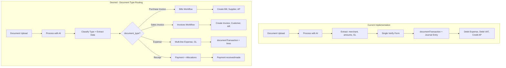
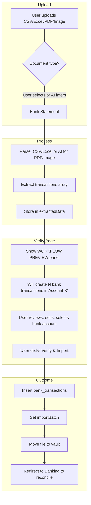

---
consolidatedFrom:
  - document_verify_workflow_analysis_dc8a5ace.plan.md
category: documents
---

# Document Workflow & Verify

Consolidated from: Document Verify Workflow Analysis.

**Related Plans:** See [01-strategic-roadmap-and-mvp.md](01-strategic-roadmap-and-mvp.md) Section F for Phase 1–2 verify flow (manual verify, AI extraction, split-screen). See [05-ai-agents-ui-spec-and-ux-audit.md](05-ai-agents-ui-spec-and-ux-audit.md) for extraction and duplicate detection APIs.

---

# Document Verify Page — How It Currently Works (and What's Missing)

## Current Flow: No Document-Type Routing

The document verify flow uses one path for all documents and does not distinguish Purchase Invoice vs Sales Invoice vs other types.

### 1. Document Processing (AI Extraction)

**File:** `src/app/api/documents/[id]/process/route.ts`

- Calls `extractInvoiceFromImage()` in `src/lib/ai/extract-invoice.ts`
- Uses a UAE-focused Gemini prompt that extracts: merchant, invoice (date/totals), `gl_prediction`, validation
- **Does not classify document type** (Purchase Invoice vs Sales Invoice vs Receipt, etc.)
- `InvoiceExtractionSchema` in `src/lib/ai/schemas.ts` has no `document_type` field
- Stored in `documents.extractedData` as JSONB

### 2. Verify Page UI

**File:** `src/app/(dashboard)/documents/[id]/verify/page.tsx`

- Single form for all documents: Date, Merchant Name, Total, VAT, Net, GL Account
- Assumes every document is an expense/purchase (merchant = supplier, GL = expense)
- No branching based on document type

### 3. Verify API — Always Uses Purchase Flow

**File:** `src/app/api/documents/[id]/verify/route.ts`

On submit, the verify API:

1. Moves the file to the retention vault in S3
2. Creates a `documentTransaction` (generic record)
3. Creates a journal entry with a fixed pattern:
   - **Debit** expense account (user-selected GL)
   - **Debit** VAT Input (1450)
   - **Credit** Accounts Payable (2010)
4. Updates `merchantMaps` for learning

It never:

- Creates a `bill` (purchases table)
- Creates an `invoice` (sales table)
- Checks document type
- Routes to different workflows or URLs

### 4. Schema

| Table | Purpose |
|-------|---------|
| `documents` | `documentType` column; stores `extractedData` JSONB |
| `documentTransactions` | Expense summary: date, amounts, merchant; `glAccountId` optional when using lines |
| `document_transaction_lines` | Expense line items: description, qty, price, amount, tax, `gl_account_id` per line |
| `bills` | Purchases — supplier, bill lines, etc. |
| `invoices` | Sales — customer, invoice lines, etc. |
| `payments`, `payment_allocations` | Receipts — payment received/made, allocated to invoices or bills |

---

## Intended Behavior (What You Described)

A document-type–aware flow would:

1. **AI classifies** the document: e.g. "Purchase Invoice", "Sales Invoice", "Receipt", "Credit Note"
2. **Route to the right workflow**:
   - **Purchase Invoice** → Bills flow (`/purchases/bills`): create Bill, link to supplier, post to AP
   - **Sales Invoice** → Sales Invoices flow (`/sales/invoices`): create Invoice, link to customer, post to AR
   - **Expense** → Multi-line expense: documentTransaction + document_transaction_lines, post to GL
   - **Receipt** → Payment allocation: sales (customer + invoice allocations) or purchase (supplier + bill allocations)
3. **Use the correct UI and API** for each type (Bill form vs Invoice form)

---

## Verification Form Structure by Document Type

The right-hand verification column must **mirror the creation form** for each document type. Reference components: CreateInvoicePanel, CreateBillPanel.

### Sales Invoice

**Mimics:** Create Invoice (customer + sales order)

| Field | Type | Notes |
|-------|------|-------|
| Issue Date | date | Pre-filled from extraction |
| Due Date | date | Pre-filled or default +30 days |
| Customer | combobox | Search/select from `customers`; AI suggests from merchant name |
| Line items table | editable rows | Description, Qty, Unit Price, Amount, Tax Rate, Tax Amount |
| Subtotal, Tax, Total | computed | Same logic as CreateInvoicePanel |

### Purchase Invoice (Bill)

**Mimics:** Create Bill (supplier + bill details)

| Field | Type | Notes |
|-------|------|-------|
| Bill Number | text | Pre-filled from extraction (invoice_number) |
| Issue Date | date | Pre-filled |
| Due Date | date | Pre-filled or default +30 days |
| Supplier | combobox | Search/select from `suppliers`; AI suggests from merchant name |
| Line items table | editable rows | Description, Qty, Unit Price, Amount, Tax Rate, Tax Amount |
| Subtotal, Tax, Total | computed | Same logic as CreateBillPanel |

### Expenses

**Mimics:** Expense entry with line items (multiple items per expense)

Expenses can be composed of multiple line items. Each line has its own description, quantity, unit price, amount, tax, and GL account allocation.

| Field | Type | Notes |
|-------|------|-------|
| Date | date | Pre-filled |
| Merchant Name | text | Pre-filled |
| Line items table | editable rows | Same structure as Bill: Description, Qty, Unit Price, Amount, Tax Rate, Tax Amount, **GL Account** (per line) |
| Subtotal, Tax, Total | computed | Sum from lines; math check (net + vat ≈ total) |
| Currency | select | Default AED |

**Reference:** CreateBillPanel line-item table; add a GL Account column per line for expense allocation.

**Schema:** Add `document_transaction_lines` table (id, document_transaction_id, description, quantity, unit_price, amount, tax_rate, tax_amount, gl_account_id, line_order). `documentTransactions` keeps totals as summary.

### Receipts

**Mimics:** Payment allocation (sales or purchase)

Receipts represent proof of payment and can allocate to multiple invoices (sales) or bills (purchase). Use receipt sub-type + allocation lines.

#### Sales Receipt (payment received)

| Field | Type | Notes |
|-------|------|-------|
| Receipt type | fixed | "Payment received (customer)" |
| Date | date | Pre-filled |
| Customer | combobox | Search/select from `customers` |
| Total amount | number | Pre-filled; must equal sum of allocations |
| Allocation lines | editable rows | Invoice (dropdown/ref), Amount allocated per invoice |
| Bank account | optional | Where payment was received |

#### Purchase Receipt (payment made)

| Field | Type | Notes |
|-------|------|-------|
| Receipt type | fixed | "Payment made (supplier)" |
| Date | date | Pre-filled |
| Supplier | combobox | Search/select from `suppliers` |
| Total amount | number | Pre-filled; must equal sum of allocations |
| Allocation lines | editable rows | Bill (dropdown/ref), Amount allocated per bill |
| Bank account | optional | Where payment was made |

**Schema:** Use existing `payments` and `paymentAllocations`. Sales receipt → Payment (received, customer) + allocations to invoices. Purchase receipt → Payment (made, supplier) + allocations to bills.

**Verify page branching:** Separate `receipt` from `expense`. Add `VerifyReceiptForm` with sales/purchase toggle, allocation lines, and validation that sum(allocations) = totalAmount.

### Bank Statements

**No form — tabular display only.** List what was captured from the uploaded document.

| Display | Notes |
|---------|-------|
| Table of extracted rows | Columns: Date, Description, Amount, Type (debit/credit), Reference, Balance (if present) |
| Editable? | Optional: allow inline edit of description, amount, or type before import |
| Bank account selector | Dropdown to assign import to a bank account |
| Workflow preview | "Will add N transactions to [Account]. Next: Reconcile in Banking" |

No customer, supplier, or line-item form. Just the tabular list of captured transactions + bank account selection + verify button.

---

## Summary: Current vs Desired



---

## What Would Be Needed to Implement Routing

1. **AI document-type classification**
   - Add a classification step (before or during extraction) that returns `document_type`: e.g. `purchase_invoice`, `sales_invoice`, `receipt`, `credit_note`
   - Update extraction schema and store `document_type` in `extractedData` or on `documents`

2. **`document_type` on documents**
   - Add `documentType` to `documents` table (or derive from `extractedData`)
   - Persist the AI classification result

3. **Verify page branching** — Each document type shows a verification form that **mimics the creation form** for that entity (see Verification Form Structure above)

4. **Verify API branching**
   - Check `document_type` and call the right handler:
     - `bill` → create Bill, Bill lines, link supplier, post to AP
     - `invoice` → create Invoice, Invoice lines, link customer, post to AR
     - `expense` → documentTransaction + document_transaction_lines, journal (line-level expense debits + VAT, credit AP)
     - `receipt` → Payment + payment_allocations (sales: received/customer/invoice; purchase: made/supplier/bill), post journal

5. **Integration with existing modules**
   - Bills workflow: create/find supplier, create Bill, post journal (AP + expense + VAT)
   - Invoices workflow: create/find customer, create Invoice, post journal (AR + revenue + VAT)

---

## Bank Statements: Current State vs Required

### Current State — Not Implemented

| Component | Status |
|-----------|--------|
| **File formats** | Document upload: PDF, JPEG, PNG, WebP only. No CSV, XLS, XLSX |
| **Bank statement import** | Banking page has "Import CSV" button — triggers `comingSoon()`, not implemented |
| **Parsing** | No CSV/Excel parsers exist. `bank_transactions` has `importBatch` (planned) but no import API |
| **Bank statement workflow** | No dedicated flow. Documents vault assumes invoices/receipts only |

**Relevant code:**
- `src/app/api/documents/upload/route.ts` — `ALLOWED_TYPES`: PDF, JPEG, PNG, WebP
- `src/app/(dashboard)/banking/page.tsx` — "Import CSV" calls `comingSoon("CSV Import")`
- `src/components/workspace/smart-drop-zone.tsx` — `accept=".pdf,.jpg,.jpeg,.png,.webp"`

### Bank Statement Formats and Processing Strategy

| Format | Parsing approach | Notes |
|--------|------------------|-------|
| **CSV** | Server-side: parse with `papaparse` or Node `csv-parse`. Map columns (date, description, debit, credit, balance) via user config or auto-detect | UAE banks vary; may need column mapping UI |
| **XLS / XLSX** | Server-side: `xlsx` or `exceljs`. Same column mapping | Same as CSV |
| **PDF** | AI (Gemini): extract table as structured data, or OCR for scanned | Same model as invoices; different prompt |
| **Image (JPG/PNG)** | AI (Gemini): vision model to extract table rows | For photographed statements |

**Output:** List of `bank_transactions` (date, description, amount, type: debit/credit, reference, balance) with `importBatch` ID.

### Bank Statement Workflow (After Verify)

1. User uploads bank statement (CSV, Excel, PDF, or image)
2. AI/parser extracts rows → `extractedData: { bankAccountId?, transactions: [...] }`
3. User sees **workflow preview**: "This will create 47 bank transactions in Main Operating Account. You can then reconcile them and match to GL."
4. User confirms → creates `bank_transactions` with `importBatch`, links to `bank_account`
5. User goes to Banking page → sees unreconciled transactions → AI suggests GL → user matches/reconciles

### Workflow Visibility — User Must See Before Verify

**Requirement:** Before clicking "Verify & File", the user must see:

- **What document type** the AI detected (e.g. "Purchase Invoice", "Bank Statement")
- **What will happen** when they verify (e.g. "Creates 1 Bill linked to supplier X, posts to Accounts Payable" vs "Creates 47 bank transactions for reconciliation")
- **Where to go next** (e.g. "View in Bills" vs "Reconcile in Banking")

**Proposed UI pattern:**

```
┌─────────────────────────────────────────────────────────────────┐
│  Workflow: Bank Statement Import                                 │
├─────────────────────────────────────────────────────────────────┤
│  ✓ AI extracted 47 transactions from this statement              │
│  → Will add to: Main Operating Account (Emirates NBD)            │
│  → Next step: Reconcile & match to GL in Banking                 │
│                                                                  │
│  [Preview transactions ▼]  [Change account]  [Verify & Import]   │
└─────────────────────────────────────────────────────────────────┘
```

For invoices:

```
┌─────────────────────────────────────────────────────────────────┐
│  Workflow: Purchase Invoice (Bill)                               │
├─────────────────────────────────────────────────────────────────┤
│  ✓ AI extracted: Starbucks, AED 52.50                            │
│  → Will create: 1 Bill, link to supplier, post to AP             │
│  → Next step: View in Purchases > Bills                          │
│                                                                  │
│  [Verify & File]                                                 │
└─────────────────────────────────────────────────────────────────┘
```

---

## What Would Be Needed for Bank Statements

1. **Extend upload** — Allow CSV, XLS, XLSX (new MIME types, `text/csv`, `application/vnd.ms-excel`, `application/vnd.openxmlformats-officedocument.spreadsheetml.sheet`)

2. **Document type at upload or first process**
   - Option A: User selects "Bank Statement" vs "Invoice" when uploading
   - Option B: AI classifies from file (e.g. CSV/Excel → likely bank statement; PDF/image → run classifier)

3. **Bank statement parser** — `lib/banking/parse-statement.ts`:
   - CSV: parse rows, optional column mapping config
   - Excel: read sheets, same mapping
   - PDF/image: Gemini with bank-statement prompt, return `{ transactions: [...] }`

4. **Bank statement verify flow**
   - New verify view or branch: show extracted transactions table, let user edit/correct, select target bank account
   - Verify API: insert into `bank_transactions` with `importBatch`, move file to vault

5. **Workflow preview component** — Reusable panel showing document type, action summary, and next-step link. Shown on all verify pages before submit.

---

## Bank Statement Flow Diagram


