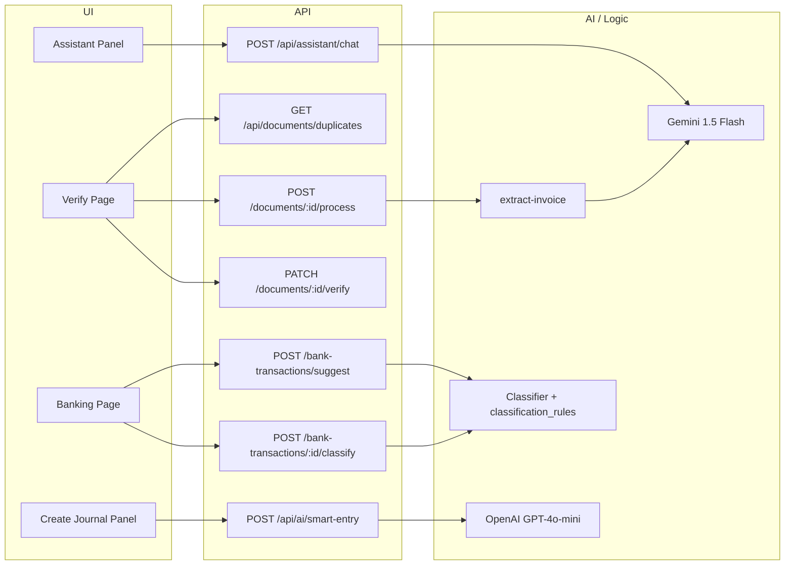

---
consolidatedFrom:
  - connect_ai_agents_next_steps_d32bb824.plan.md
  - ai-native-accounting-ui-spec-4d780d.md
  - full-ui-audit-ai-fixes-4d780d.md
category: ai
---

# AI Agents, UI Spec & UX Audit

Consolidated from: Connect AI Agents Next Steps, AI-Native Accounting UI Spec, Full UI/UX Audit & AI-Distinction Fixes.

**Cross-reference:** Anomaly detection, duplicate checks, and NL search in Part II use mock data. See Part I for real API implementation.

---

# Part I: AI Agents Connection (Backend)

## Current State

**Already connected:**

- **Document extraction (Gemini 1.5 Flash)** – `extract-invoice.ts` uses real Gemini with UAE invoice prompt, Zod validation, and math guard. No mock.
- **Process pipeline** – `POST /api/documents/[id]/process` checks tokens/archive, fetches from S3, runs extraction, updates document, decrements `tokenBalance`, and writes audit log.
- **Verify pipeline** – `PATCH /api/documents/[id]/verify` moves file to retention vault, creates `document_transactions`, creates journal entry + lines (expense, VAT input, AP), upserts `merchant_maps`, and logs audit. GL prediction is resolved to `chart_of_accounts.id` on the verify page for pre-fill.
- **VAT 201** – `GET /api/reports/vat-201` returns box-level data from `documentTransactions`, invoices, and bills.
- **Schema** – `documents`, `document_transactions`, `merchant_maps`, `organizations.tokenBalance` / `subscriptionPlan` exist and are used.

**Not yet connected:**

- **AI Assistant panel** – Still mock: hardcoded responses in `assistant-panel.tsx` and a generic fallback; no backend call.
- **Smart entry bar (NL → structured transaction)** – Referenced in Main Plans (OpenAI GPT-4o-mini) but no `nl-parser` or API in the codebase.
- **Bank classification** – `classification_rules` table exists in schema.ts; no classifier/rules-engine or API that suggests GL for bank transactions or learns from corrections.
- **Duplicate detection** – Verify page uses mock logic ("In production, this would be an API call"); no server-side duplicate check.

---

## 1. AI Assistant Chat API

**Goal:** Replace mock responses with a live AI that can answer accounting questions in context, with token metering.

**Implementation:**

- Add **POST /api/assistant/chat** (or `/api/ai/chat`):
  - Accept `{ message: string }` (and optionally `context?: { pathname, entityId }`).
  - Resolve `organizationId` from session; enforce `tokenBalance >= 0.1` (or 1 if you use whole tokens); return 402 if insufficient.
  - Call **Gemini** (or OpenAI) with a system prompt that describes the app (UAE accounting, documents, VAT, invoices, bank reconciliation) and optional context (e.g. "User is on /sales").
  - Parse response and return `{ reply: string }` (or stream).
  - Decrement `organizations.tokenBalance` by 0.1 (or 1) on success; log to `audit_logs` (e.g. `action: "assistant_query"`).
- In `assistant-panel.tsx`:
  - Replace `handleQuery` so it calls this API instead of `aiResponses[query]` and the generic fallback.
  - Keep suggestion chips as shortcuts that send the same query to the API; show loading and errors (e.g. "Out of tokens" / upgrade CTA when 402).

**Design choice:** Use Gemini (already in use for extraction) for consistency and one key, or OpenAI as in Main Plans; either way, document the choice and add the corresponding env var (e.g. `OPENAI_API_KEY` if used).

---

## 2. Smart Entry Bar (natural language → structured transaction)

**Goal:** Let users type a sentence (e.g. "Office supplies 500 AED from ACE") and get a structured journal entry suggestion, per Main Plans.

**Implementation:**

- Add **lib/ai/nl-parser.ts** (or **lib/ai/smart-entry.ts**):
  - Call **OpenAI GPT-4o-mini** (as in Main Plans) with a strict prompt + structured output (e.g. JSON: `{ date, lines: [{ accountCodeOrName, debit, credit, description }] }`). Map to your CoA (e.g. UAE codes) so the result references valid accounts.
- Add **POST /api/ai/smart-entry** (or under journal):
  - Body: `{ nl: string }`.
  - Resolve org; optionally check tokens and decrement (if you meter smart entry).
  - Call nl-parser; resolve returned account codes/names to `chart_of_accounts.id` for current org.
  - Return `{ suggestedEntry: { date, lines: [{ accountId, accountCode, name, debit, credit, description }] } }` for the UI to pre-fill or confirm.
- Wire the **create journal entry** UI (e.g. `create-journal-entry-panel.tsx`) to an input that sends `nl` to this API and pre-fills the form (or show a confirmation step before posting).

**Dependency:** Ensure OpenAI SDK and `OPENAI_API_KEY` are available.

---

## 3. Bank Classification (rule-based + learning)

**Goal:** Suggest GL for bank transactions using rules and per-org learning, and feed corrections back into learning (Main Plans Sprint 6).

**Implementation:**

- Add **lib/ai/classifier.ts** (and optionally **lib/ai/rules-engine.ts**):
  - **Input:** Bank transaction line (description, amount, date, merchant if available).
  - **Rules:** Pattern matching (keywords, merchant substrings) against a small rule set that maps to GL account codes. Use `classification_rules` for the org to apply learned overrides first (e.g. "STARBUCKS" → 6400).
  - **Output:** Suggested `gl_account_id` (or code) and confidence (e.g. 0–1). If no rule matches, return null or a default "Uncategorized" account.
- Add **POST /api/bank-transactions/suggest** (or GET with query params):
  - Body or params: transaction description, amount, optional merchant.
  - Return `{ suggestedGlAccountId, suggestedGlCode, confidence }` for the current org.
- **Learning:** When the user confirms or changes a classification on the banking reconciliation UI, call an API (e.g. **POST /api/bank-transactions/:id/classify** or **PATCH** with `glAccountId`) that:
  - Saves or updates a row in `classification_rules` (e.g. pattern from description/merchant → `gl_account_id`) so future suggestions use it.
- Wire the **banking page** to:
  - Show "Suggest GL" (or auto-suggest) using the suggest API.
  - On user apply/correct, call the classify API to persist learning.

**Note:** Main Plans use "rule-based + learning"; no LLM is required for this agent if you keep it pattern + `classification_rules` only. You can later add an optional LLM pass for ambiguous lines.

---

## 4. Real Duplicate Detection for Documents

**Goal:** Replace the mock duplicate check on the verify page with a server-side check so users see real potential duplicates before verifying.

**Implementation:**

- Add **GET /api/documents/duplicates** (or include duplicate candidates in **GET /api/documents/[id]** response):
  - Query params or body: `merchantName`, `amount`, `date` (or `documentId` and derive from document).
  - Search `document_transactions` (and optionally `documents`) for the same org with similar merchant (e.g. normalized name), same or very close amount, and date within a window (e.g. ±7 days). Return a list of `{ documentId, merchantName, amount, date, similarity }`.
- On the **verify page**, when loading the document, call this API with the extracted merchant and amount (and date); display results in the existing DuplicateWarning component instead of the hardcoded mock.

---

## 5. Optional Improvements (from MVP plan)

- **Token refill:** Implement periodic refill (e.g. monthly reset to plan limit 50/300/1000) and show upgrade CTA when balance is 0 (already partially in place via 402 from process API).
- **PDF for Gemini:** Current code sends PDF bytes with `mimeType: "application/pdf"`; Gemini 1.5 supports PDF. If you hit limits or quality issues, add a step to convert PDF pages to images and send the first (or all) pages.
- **Audit:** Assistant and smart-entry flows should write to `audit_logs` (e.g. `assistant_query`, `smart_entry_used`) for compliance and support.

---

## Suggested Order of Work

| Priority | Item | Effort |
| -------- | ---- | ------ |
| 1 | Assistant chat API + wire panel | Medium |
| 2 | Duplicate detection API + wire verify page | Small |
| 3 | Bank classifier + suggest/classify APIs + wire banking page | Medium |
| 4 | Smart entry (nl-parser + API + wire journal UI) | Medium |

This order connects the visible "AI" surfaces first (assistant, duplicates), then adds the two Main Plans agents (bank classification, smart entry).

---

## Architecture Snapshot (after AI agents are connected)



---

## Key Files to Add or Extend

| Area | Action |
| ---- | ------ |
| `assistant-panel.tsx` | Call real chat API; remove mock map; handle 402 and errors |
| New: `app/api/assistant/chat/route.ts` (or `api/ai/chat`) | Chat endpoint with Gemini/OpenAI and token decrement |
| New: `lib/ai/nl-parser.ts` or `lib/ai/smart-entry.ts` | OpenAI structured call for NL → journal suggestion |
| New: `app/api/ai/smart-entry/route.ts` | Smart entry endpoint; resolve accounts and return suggested entry |
| New: `lib/ai/classifier.ts` (and optionally `rules-engine.ts`) | Rule-based + classification_rules for bank GL suggestion |
| New: `app/api/bank-transactions/suggest/route.ts` | Suggest GL for a bank line |
| New or extend: bank-transactions classify API | Persist user correction to classification_rules |
| `banking/page.tsx` | Use suggest/classify and show "Suggest GL" / learning |
| New: `app/api/documents/duplicates/route.ts` (or in GET document by id) | Return duplicate candidates by merchant/amount/date |
| `documents/[id]/verify/page.tsx` | Fetch duplicates from API and pass to DuplicateWarning |
| `create-journal-entry-panel.tsx` | Add smart entry input and wire to smart-entry API |

Once these are in place, all planned AI agents (document extraction, assistant chat, smart entry, bank classification) are implemented and connected end-to-end, with duplicate detection backed by real data.

---

# Part II: AI-Native UI Spec (Trust but Verify)

## Current State Summary

**Already built:**
- Finsera design system: warm gradient bg, white 24px-radius cards, Plus Jakarta Sans, glass AI panel, dark mode
- TopNav (frosted pill center nav), Breadcrumbs, PageHeader, dashboard with metric cards + charts
- AI Assistant panel (context-aware chips per route, NL document search, reconciliation hints, mock responses)
- Document Vault: upload API → S3 (`temp/`), process API (Gemini 1.5 Flash extraction), verify API (split-screen form + iframe PDF viewer, journal entry creation, merchant map upsert, audit log)
- Schema: `documents`, `documentTransactions`, `merchantMaps`, full double-entry accounting, token economy (`tokenBalance`, `subscriptionPlan` on orgs)
- Storage: S3 vault (`vault.ts` — upload, move to retention, presigned URLs)
- AI extraction: `extract-invoice.ts` with UAE prompt, Zod validation, math guard
- Design system extensions: `--accent-ai`, confidence tokens, SmartField, TokenMeter in TopNav
- Smart Drop Zone: multi-file drag-and-drop with idle/hover/uploading/error states
- Split-screen workspace: `react-resizable-panels` draggable layout + Zustand store (zoom, rotation, activeField, userEdits)
- Dashboard widgets: VAT Liability Estimator, Expense Donut (recharts), Token Usage bar chart (recharts), Anomaly Alert
- Micro-interactions: ShakeWrapper (error), FileAwayAnimation (success), FadeIn. Learning toasts. Confidence tooltips.
- Batch processing: "Process All" button on documents page with progress feedback
- AI recommendations: GLCombobox (verify), AnomalyAlert (dashboard), DuplicateWarning, BatchReport, reconciliation hints (banking)
- Mobile PWA foundation: manifest.json, Apple meta tags, CameraCapture component
- All native `<select>` elements replaced with StyledSelect

**What still needs work (from the spec):**

| Spec Section | Gap | Effort |
|--------------|-----|--------|
| PDF Viewer | Still using iframe. Need react-pdf + pdfjs-dist with bounding box overlays and surgical zoom | 4-5 hrs |
| Queue Auto-Advance | After "Verify & File", should auto-open next pending document | 1 hr |
| FileAway Animation | Component exists but not wired into verify success flow | 0.5 hr |
| Stacked Review Mode | No mobile swipeable card UI for batch document verification | 2-3 hrs |
| Responsive Layouts | Dashboard, documents, verify, banking all use fixed 12-col grid with no mobile breakpoints | 3-4 hrs |
| Component Integration | DuplicateWarning, BatchReport, CameraCapture components exist but aren't wired to pages yet | 1-2 hrs |

---

## Design Decisions

1. **Keep TopNav as primary navigation** — The spec describes a sidebar, but the existing Finsera design uses a centered pill nav which is already polished and consistent across all pages. **Hybrid approach**: Add a collapsible sidebar for the Document Vault / Smart Vault workspace only (where users spend 90% of their time), while keeping TopNav for global navigation. The Token Meter moves to the TopNav right section (always visible) AND appears in the sidebar when in Vault view.

2. **Adapt spec palette to existing brand** — Map the spec's "Deep Navy / Electric Blue / Emerald / Amber / Crimson" to existing tokens:
   - Deep Navy → `--text-primary` (#0F172A) ✓ already matches
   - Electric Blue (AI Actions) → new `--accent-ai` (#3B82F6) for AI-specific actions
   - Emerald → `--success` (#22C55E) ✓
   - Amber → `--accent-yellow` (#FBBF24) ✓
   - Crimson → `--error` (#EF4444) ✓

3. **react-pdf over react-pdf-highlighter** — `react-pdf-highlighter` is unmaintained and heavy. Use `react-pdf` (pdfjs-dist) with custom overlay canvas for bounding boxes. Lighter, more control.

---

## Implementation Phases A–G (All 32 items)

### Phase A: Design System Extensions (2-3 hours) — ✅ COMPLETE

1. [x] **New CSS tokens** — Added `--accent-ai`, `--confidence-high/medium/low` to `globals.css` (light + dark). Added `.field-confidence-*` utility classes and `.ai-glow`.
2. [x] **SmartField component** — Created `components/workspace/smart-field.tsx`: confidence border (green/amber/red), tooltip icons (CheckCircle2/AlertTriangle/AlertCircle), error message display.
3. [x] **Token Meter component** — Created `components/ui/token-meter.tsx`: progress bar + count + tooltip + link to settings. Color-codes low balance.
4. [x] **Update TopNav** — TokenMeter added to TopNav right section. Removed old dashboard-only token badge.

### Phase B: Smart Drop Zone (Dashboard) (3-4 hours) — ✅ COMPLETE

5. [x] **SmartDropZone component** — Created with all states: idle (dashed/cloud), drag-over (blue tint/scale), uploading (per-file progress + remove), error (toast). Multi-file, type/size validation.
6. [x] **Dashboard integration** — SmartDropZone on Documents page. Dashboard widgets: VAT Liability Estimator, Expense Breakdown donut, Token Usage bar chart.

### Phase C: Split-Screen Workspace (8-10 hours) — ✅ COMPLETE

7. [x] **Install react-pdf** — react-pdf v10.3.0 + pdfjs-dist v5.4.624. PdfViewer with bounding box overlays, field click handler, rotation/zoom from Zustand.
8. [x] **Workspace Layout** — react-resizable-panels, draggable divider, 30% min panel size. Mobile-responsive: stacks vertically on ≤768px.
9. [x] **Left Pane: Smart Viewer** — react-pdf rendering, bounding box overlays, zoom/rotation, activeField in Zustand.
10. [x] **Right Pane: Verification Form** — SmartField, GLCombobox, DuplicateWarning, math mismatch detection.
11. [x] **Zustand Store** — documentId, extractedData, activeField, userEdits, zoom, rotation.
12. [x] **Learning Interaction** — Toast on GL override: "Preference saved. We'll remember [category] for [Merchant] next time."
13. [x] **Verify page rewrite** — Full WorkspaceLayout, PdfViewer, FileAwayAnimation, queue auto-advance, ShakeWrapper, DuplicateWarning.

### Phase D: Document Vault List Upgrade (2-3 hours) — ✅ COMPLETE

14. [x] **Redesign documents page** — Filter tabs: All | Pending | Flagged | Verified. Responsive table.
15. [x] **Smart Drop Zone at top** — Multi-file drag-and-drop, mobile camera capture.
16. [x] **Queue behavior** — Auto-redirect to next pending doc after verify.
17. [x] **Batch processing** — "Process All (N)" button, BatchReport card.

### Phase E: Micro-Interactions & Feedback (2-3 hours) — ✅ COMPLETE

18. [x] **Success animation** — FileAwayAnimation on verify success.
19. [x] **Error shake** — ShakeWrapper on math mismatch.
20. [x] **Learning toast** — Merchant-specific message on GL override.
21. [x] **Confidence tooltips** — SmartField tooltips per confidence level.

### Phase F: Mobile PWA Foundation (3-4 hours) — ✅ COMPLETE

22. [x] **PWA manifest + meta tags** — manifest.json, Apple meta tags.
23. [x] **Camera capture component** — Integrated into SmartDropZone.
24. [x] **Stacked review mode** — Card stack UI for mobile.
25. [x] **Responsive layouts** — Dashboard, Banking, Documents, Verify responsive.

### Phase G: Additional AI-Powered Recommendations (2-3 hours) — ✅ COMPLETE

26. [x] **Anomaly Detection Alerts** — Dismissible amber cards. Mock data. *See Part I for real API.*
27. [x] **Smart GL Auto-Complete** — GLCombobox with AI suggestion row.
28. [x] **Duplicate Detection** — DuplicateWarning component. Mock data. *See Part I for real API.*
29. [x] **Predictive VAT Liability** — Dashboard widget, Assistant chip.
30. [x] **AI-Assisted Reconciliation Hints** — Banking page Sparkles, Auto-Reconcile. Mock responses.
31. [x] **Batch Intelligence Report** — BatchReport card.
32. [x] **Natural Language Document Search** — Assistant chips. Mock NL responses. *See Part I for real API.*

---

## File Structure (New/Modified)

```
src/
  components/
    workspace/   workspace-layout.tsx, pdf-viewer.tsx, smart-field.tsx, smart-drop-zone.tsx
    ai/          gl-combobox.tsx, anomaly-alert.tsx, duplicate-warning.tsx, batch-report.tsx, assistant-panel.tsx
    ui/          token-meter.tsx, styled-select.tsx, motion-wrappers.tsx
    charts/      expense-donut.tsx, token-usage-chart.tsx
    mobile/      camera-capture.tsx, stacked-review.tsx
  hooks/
    use-workspace-store.ts
  app/
    layout.tsx, globals.css
    (dashboard)/ dashboard/page.tsx, documents/page.tsx, documents/[id]/verify/, banking/page.tsx
  public/
    manifest.json
```

---

## Dependencies

| Package | Purpose | Status |
|---------|---------|--------|
| `react-resizable-panels` | Draggable split pane | ✅ Installed |
| `zustand` | Workspace state store | ✅ Installed |
| `framer-motion` | Animations | ✅ Installed |
| `recharts` | Dashboard charts | ✅ Installed |
| `react-pdf` v10.3.0 + `pdfjs-dist` v5.4.624 | PDF rendering | ✅ Installed |
| `next-pwa` (optional) | Service worker + offline caching | ❌ Not installed |

---

## Remaining Gaps

| # | Enhancement | Impact | Notes |
|---|-------------|--------|-------|
| 1 | Service worker (next-pwa) for offline caching | Low | Would enable offline document review on mobile |
| 2 | Surgical zoom (click bounding box → auto-zoom to region) | Low | Requires additional math |
| 3 | Real bounding box coordinates from Gemini extraction | Medium | Currently using mock positions |
| 4 | Replace mock AI data with real API responses | Medium | Anomaly detection, duplicate checks, NL search — see Part I |

---

# Part III: Full UI/UX Audit & AI-Distinction Fixes

## Q1: Do invoice/bill/expense forms have a side-by-side document viewer?

**No.** None of the current form panels display an uploaded source document alongside the form.

| Panel | Current Layout | Document Viewer? |
|-------|----------------|------------------|
| `CreateInvoicePanel` | EntityPanel (Main form + Sidebar settings) | **No** — pure data entry, no document attachment or viewer |
| `CreateBillPanel` | EntityPanel (Main form + Sidebar settings) | **No** — same pure entry, no option to attach/view a source bill/receipt |
| `RecordPaymentPanel` | EntityPanel (Main form + Sidebar settings) | **No** — no receipt/proof viewer |
| `CreateJournalEntryPanel` | EntityPanel (Main form + Sidebar settings) | **No** — no source doc reference |
| `AddCustomerPanel` | EntityPanel (Main + Sidebar) | N/A — entity form, not transaction |
| `AddSupplierPanel` | EntityPanel (Main + Sidebar) | N/A — entity form |
| Document Verify page | Basic `grid-cols-2` (iframe + form) | **Yes** — but basic iframe, no PDF controls, no confidence signaling |

**The only place with a document viewer is `/documents/[id]/verify/page.tsx`**, which now uses react-pdf (per Part II). The sales/purchase/expense creation panels are entirely manual-entry with no way to attach or view a source document.

---

## Gap Categories

### A. Missing AI Identity

| # | Gap | Where | Fix |
|---|-----|-------|-----|
| A1 | **No AI sparkle/indicator anywhere on forms** | All 7 EntityPanel modals | Add Sparkles icon + "AI can auto-fill this" hint. |
| A2 | **No AI auto-fill on invoice/bill creation** | CreateInvoicePanel, CreateBillPanel | Add "Scan document to auto-fill" — DONE via AttachDocumentZone |
| A3 | **AI Assistant panel is disconnected** | AssistantPanel — mock responses | Wire to real chat API — see Part I |
| A4 | **No AI-powered insights on module pages** | Sales, Purchases, Banking, etc. | Add AiInsightBanner — DONE |
| A5 | **Document verify page has no confidence signaling** | verify/page.tsx | SmartField with green/amber/red borders — DONE |
| A6 | **No "learning" feedback** | Verify flow | Learning toast on GL override — DONE |
| A7 | **Token meter is barely visible** | Dashboard only | TokenMeter in TopNav — DONE |

### B. Missing Document Attachment on Forms

| # | Gap | Fix |
|---|-----|-----|
| B1 | CreateBillPanel has no "Attach document" option | AttachDocumentZone with "Scan with AI" — DONE |
| B2 | CreateInvoicePanel has no attachment | Optional attach in sidebar — DONE |
| B3 | No side-by-side view on any form | Add mode: document attached → split-view (document left, form right) |

### C. Visual & Interaction Polish Gaps

| # | Gap | Where | Fix |
|---|-----|-------|-----|
| C1 | `showActions={false}` on most pages | Sales, Purchases, etc. | Enable on key pages — DONE |
| C2 | Empty state on documents page is plain | documents/page.tsx | Smart Drop Zone — DONE |
| C3 | Upload is a hidden file input | Documents page | SmartDropZone — DONE |
| C4 | No filter tabs on documents list | Documents page | All | Pending | Flagged | Verified — DONE |
| C5 | Banking "Match" button → comingSoon | Banking page | AI suggestion in popover |
| C6 | No loading skeletons | All pages | SkeletonCard, SkeletonRow — DONE |
| C7 | Report pages are just link cards | Reports hub | Add mini preview per report card |
| C8 | `alert()` used for errors | Multiple pages | Sonner toasts — DONE |
| C9 | Login page has no AI branding | login/page.tsx | Sparkles + tagline — DONE |
| C10 | Dark mode not toggled properly | Settings | Wire to next-themes provider |

### D. Consistency & Component Gaps

| # | Gap | Fix |
|---|-----|-----|
| D1 | Plain `<select>` used everywhere | Replace with StyledSelect/Combobox — StyledSelect DONE, some plain selects remain |
| D2 | Tables use inline grid styling | Create reusable DataTable per UI Kit Structure |
| D3 | No empty states for tables | Add "No results" message |
| D4 | Expanded invoice/bill rows lack actions | Add Edit, Duplicate, Email, Delete in expanded view |

---

## Implementation Plan (Phases 1–3)

### Phase 1: AI Identity & Distinction — ALL DONE

1. [x] Enable AI sparkle on all EntityPanel forms
2. [x] Add "Scan Document" to bill/invoice creation
3. [x] Confidence signaling on verify page
4. [x] Learning feedback toast
5. [x] Context-aware AI Assistant chips
6. [x] Token Meter in TopNav

### Phase 2: Document Attachment on Bill/Invoice Forms — ALL DONE

7. [x] AttachDocumentZone component
8. [x] Bill form scan-to-fill
9. [x] Smart Drop Zone on Documents page

### Phase 3: Polish & Consistency — 3/4 DONE

10. [x] Replace all `alert()` with Sonner toasts
11. [x] Add filter tabs to documents list
12. [x] Enable showActions on key pages
13. [x] AI insight cards on module pages
14. [x] Login page AI branding
15. [x] Loading skeletons
16. [ ] **Styled selects** — NOT DONE. Plain `<select>` elements remain across some forms.

---

## Files to Create/Modify

**New components:** smart-field.tsx, token-meter.tsx, attach-document-zone.tsx, smart-drop-zone.tsx, ai-insight-banner.tsx, skeleton-card.tsx

**Modified files:** create-bill-panel.tsx, create-invoice-panel.tsx, create-journal-entry-panel.tsx, add-item-panel.tsx, top-nav.tsx, assistant-panel.tsx, documents/verify/page.tsx, documents/page.tsx, sales/page.tsx, purchases/page.tsx, banking/page.tsx, dashboard/page.tsx, login/page.tsx, globals.css

---

## Priority Order

| Priority | Items | Impact | Status |
|----------|-------|--------|--------|
| **P0 — Do first** | AI sparkles, confidence fields, token meter, alert→toast | Immediate AI identity + polish | **ALL DONE** |
| **P1 — Core AI** | Scan-to-fill bills, learning toast, context chips, insight banners | Core differentiator | **ALL DONE** |
| **P2 — Document UX** | Attach zone, bill split-view, smart drop zone, filter tabs | Document workflow | **ALL DONE** |
| **P3 — Polish** | showActions, login branding, skeletons, styled selects | Professional finish | **3/4 DONE** (styled selects remaining) |
