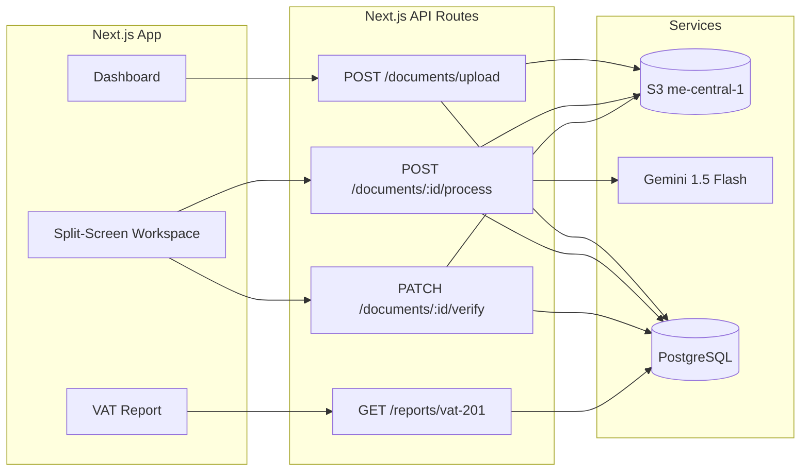

# AI-Native Accounting Suite (UAE) – MVP Execution Plan

## Current State vs Blueprint

| Blueprint                                | Current codebase                                                                                                                                                                                                                |
| ---------------------------------------- | ------------------------------------------------------------------------------------------------------------------------------------------------------------------------------------------------------------------------------- |
| **Stack**                                | Next.js 16, App Router, Tailwind, Shadcn, Zustand, Zod, Drizzle, PostgreSQL, Supabase auth. No NestJS, no Prisma, no monorepo.                                                                                                  |
| **Tenant**                               | `organizations` table exists (name, currency, tax_registration_number, etc.) but no `tokenBalance`, `subscriptionPlan`, or Plan enum.                                                                                           |
| **Document / Transaction / MerchantMap** | Not present. `journalEntries.sourceId` can reference a document; `classification_rules` is pattern-based, not merchant→GL.                                                                                                      |
| **Auth**                                 | Supabase (login, signup, middleware). Onboarding has TODO: "Create organization in database via server action".                                                                                                                 |
| **API**                                  | Only `auth/callback` route. No `/api/v1/documents/*` or reports API.                                                                                                                                                            |
| **AI**                                   | Assistant panel with mock responses; no Gemini, no extraction, no queue.                                                                                                                                                        |
| **Workspace**                            | No split-screen (PDF + form), no `react-pdf` / pdf.js, no document upload or verify flow.                                                                                                                                       |
| **VAT**                                  | [vat/page.tsx](accounting-ai/src/app/(dashboard)/vat/page.tsx) and [vat-data mock](accounting-ai/src/lib/mock/vat-data.ts); [vatReturns](accounting-ai/src/lib/db/schema.ts) table exists but no FTA VAT 201 Box 1a–15 mapping. |
| **Storage / Queue**                      | No S3, no BullMQ.                                                                                                                                                                                                               |

**Recommendation:** Keep the existing stack for the MVP. Implement document APIs and AI pipeline in **Next.js API routes** (and optional serverless/worker) rather than introducing NestJS in Phase 1; you can add a NestJS service later if needed.

---

## Alignment with Main Plans

This MVP plan is designed to work with the existing **Main Plans** so implementation is consistent and non-conflicting:

- **[Main Plans/final-implementation-plan-fb14b0.md](Main Plans/final-implementation-plan-fb14b0.md)** – Finsera-style UI, 9-sprint roadmap, design system, file structure, accounting engine rules.
- **[Main Plans/ai-accounting-saas-plan-fb14b0.md](Main Plans/ai-accounting-saas-plan-fb14b0.md)** – Technical stack, DB schema, AI hybrid (OpenAI + rule-based), deferred items.

### Resolved decisions (no conflicts)

| Topic                      | Main Plans                                                                                     | This MVP (Zero-Entry / Vault)                                               | Resolution                                                                                                                                                                                                            |
| -------------------------- | ---------------------------------------------------------------------------------------------- | --------------------------------------------------------------------------- | --------------------------------------------------------------------------------------------------------------------------------------------------------------------------------------------------------------------- |
| **Stack**                  | Next.js 14+, Drizzle, Supabase, Tailwind, shadcn, Zustand, TanStack Query                      | Same                                                                        | No change.                                                                                                                                                                                                            |
| **Auth & multi-tenancy**   | Supabase Auth, RLS, `organization_id` on every table                                           | Same; add current-org resolution (cookie/preference)                        | Use RLS and org from session for all new document/report APIs.                                                                                                                                                        |
| **Accounting engine**      | Immutable journal_entries + journal_lines, double-entry CHECK, period locking                  | Same                                                                        | On verify, create journal entry from Transaction so ledger and VAT 201 stay in sync (per Gaps section).                                                                                                               |
| **File storage**           | Supabase Storage                                                                               | AWS S3 me-central-1 for Document Vault                                      | **Dual storage:** Supabase Storage for general app files (invoices, avatars, exports) per Main Plans; **AWS S3 (UAE, Object Lock)** only for the compliance Document Vault (upload → temp, verify → retention-vault). |
| **AI**                     | OpenAI GPT-4o-mini (smart entry bar), rule-based (bank classification), `classification_rules` | Google Gemini 1.5 Flash (invoice/receipt extraction)                        | **Both:** Gemini for document extraction (this MVP); OpenAI + rules for NL entry and bank matching (Main Plans Sprints 6 & 8). No overlap.                                                                            |
| **PDF**                    | @react-pdf/renderer (generate invoice/bill PDFs)                                               | react-pdf / react-pdf-highlighter + pdf.js (view + highlight uploaded PDFs) | **Both:** Keep @react-pdf/renderer for generation; add viewer stack only for the split-screen document verify UI.                                                                                                     |
| **Design**                 | Finsera: gradient, 24px cards, Plus Jakarta Sans, glass-dark AI panel                          | Same UI already in app                                                      | All new pages (document list, split-screen verify) use existing layout, TopNav, Breadcrumbs, dashboard-card, and AI panel patterns from Main Plans.                                                                   |
| **VAT**                    | VAT summary, return prep, reverse charge (Sprint 7); "FTA VAT format" deferred                 | VAT 201 FTA box mapping + API (Phase 3)                                     | **Promoted:** FTA-aligned VAT 201 is in scope for this MVP (Phase 3). Implement after Sprint 7 VAT module; reuse `vat_returns` and add box-level data or query as needed.                                             |
| **Deferred in Main Plans** | OCR receipt scanning, FTA VAT submission                                                       | Document extraction + VAT 201 report                                        | **Scope:** This MVP implements “OCR-like” (Gemini extraction) and FTA VAT 201 report; submission to FTA portal remains optional/post-MVP.                                                                             |

### Sprint–phase map (unified timeline)

Main Plans use **9 sprints (~20 weeks)**. The codebase is already past Sprint 1 (foundation, dashboard, auth shell). Map this MVP onto the same sprints so one backlog covers both:

| Main Plans sprint              | MVP phase / work                                                                 | Notes                                                                                                                                                          |
| ------------------------------ | -------------------------------------------------------------------------------- | -------------------------------------------------------------------------------------------------------------------------------------------------------------- |
| **Sprint 1–2** (Foundation)    | Done (current app)                                                               | Complete any remaining Main Plans items (org creation in DB, RLS, settings).                                                                                   |
| **Sprint 2** (Accounting Core) | —                                                                                | Main Plans only (CoA, journal, GL, trial balance, periods, audit).                                                                                             |
| **Sprint 3** (Sales + VAT)     | —                                                                                | Main Plans only.                                                                                                                                               |
| **Sprint 4** (Purchases)       | **MVP Phase 1** (Document Vault)                                                 | Add documents/transactions/merchant_maps schema, S3 vault upload, document list, manual verify. Fits here because documents are often purchase receipts/bills. |
| **Sprint 5** (Inventory)       | —                                                                                | Main Plans only.                                                                                                                                               |
| **Sprint 6** (Banking)         | —                                                                                | Main Plans only (classification_rules, bank matching).                                                                                                         |
| **Sprint 7** (VAT Module)      | —                                                                                | Main Plans VAT summary + return prep.                                                                                                                          |
| **Sprint 8** (AI + Reports)    | **MVP Phase 2** (AI extraction + split-screen) + **Phase 3** (VAT 201 + Archive) | Add Gemini extraction, token economy, split-screen verify; then VAT 201 API + UI and Archive mode. Aligns with “AI + Reports + Polish”.                        |
| **Sprint 9** (Launch Prep)     | —                                                                                | Shared launch prep; include document vault and token UX in hardening.                                                                                          |

If you run sprints strictly in order, do **Phase 1 (Document Vault)** in Sprint 4 and **Phases 2–3** in Sprint 8. If you need the “zero-entry” flow earlier, Phase 1 can move to Sprint 3 (after Sales) and Phase 2 to Sprint 6 or 7.

### File structure and schema (from Main Plans)

- **File structure:** Keep [Main Plans section 6](Main Plans/final-implementation-plan-fb14b0.md) layout. Add under `/lib/ai/`: `extract-invoice.ts` (Gemini), `schemas.ts` (Zod for extraction); keep existing `classifier.ts`, `nl-parser.ts`, `rules-engine.ts` for NL entry and bank classification. Add `/lib/vat/` if not present: `calculator.ts`, `return-builder.ts`; extend for VAT 201 box mapping in Phase 3.
- **Schema:** Main Plans list `vat_return_lines`; current Drizzle schema has `vat_returns`. Add `vat_return_lines` (or equivalent box-level storage) when implementing VAT 201 if needed. All new tables (`documents`, `transactions`, `merchant_maps`) must include `organization_id` and be covered by RLS.
- **Hooks:** Use or add `use-organization` (current org from cookie/preference) so document and report APIs receive a single org context.

### What stays deferred (both plans)

- Stripe subscription billing (token refill can be manual or cron for MVP).
- Arabic UI, FIFO costing, bank feeds API, approval workflows, full payroll/WPS, multi-warehouse.
- Direct FTA portal submission (VAT 201 export/copy only in MVP).
- Corporate Tax (9%) return.

---

## Phase 1 – Foundation + Smart Vault (MVP 1)

**Goal:** Secure org creation, file upload to UAE S3, and a minimal “document vault” with manual entry path. No AI yet.

### 1.1 Foundation

- **Onboarding → DB:** Replace the TODO in [onboarding/page.tsx](accounting-ai/src/app/(auth)/onboarding/page.tsx) with a server action (or API route) that: creates a row in `organizations` (and `user_roles` linking the current user), using Supabase `user.id` and existing Drizzle schema. Ensure dashboard/workspaces resolve current org from session (e.g. first org or selected org in cookie/header).
- **Tenant fields:** In [schema.ts](accounting-ai/src/lib/db/schema.ts), add to `organizations`: `subscriptionPlan` (e.g. `varchar('subscription_plan', { length: 20 }).default('FREELANCER')`), `tokenBalance` (`integer('token_balance').default(50)`). Add a `Plan` const/enum in code for FREELANCER / BUSINESS / ENTERPRISE if you want type safety.
- **Workspaces page:** Replace hardcoded `organizations` in [workspaces/page.tsx](accounting-ai/src/app/(dashboard)/workspaces/page.tsx) with data from DB (server component or fetch from API) and persist “current workspace” (e.g. cookie or user preference table) so all document/transaction flows are org-scoped.

### 1.2 Document Vault schema (Drizzle)

Add to [schema.ts](accounting-ai/src/lib/db/schema.ts) (align with blueprint; keep naming consistent for later AI):

- **documents:** `id`, `organization_id`, `s3_key`, `status` (e.g. `pending` | `processed` | `flagged` | `archived`), `ai_confidence` (numeric, nullable for manual), `extracted_data` (jsonb), `created_at`. No `transaction_id` yet if you want 1:1 only after verify.
- **transactions (document-derived):** `id`, `document_id` (unique), `date`, `total_amount`, `vat_amount`, `net_amount`, `currency`, `merchant_name`, `gl_account_id` (FK to `chart_of_accounts`), `organization_id`, timestamps. This is the “accounting entry” from the blueprint.
- **merchant_maps:** `id`, `organization_id`, `merchant_name`, `gl_account_id`, `confidence`, `last_used`, unique on `(organization_id, merchant_name)`. This is the “Smart Learning” table.

Run Drizzle migrations and ensure relations (e.g. document → transaction) are defined.

### 1.3 Infrastructure

- **AWS:** Create bucket in `me-central-1` (UAE), IAM user/role for app, Object Lock enabled for compliance (WORM). Use a prefix like `temp/` for uploads before verify and `retention-vault/` for verified (locked).
- **Upload API:** Implement `POST /api/v1/documents/upload` (or `app/api/documents/upload/route.ts`): multipart form, validate file type (PDF/image), upload to S3 `temp/`, insert row in `documents` with `status: PENDING`, `extracted_data: null`, return `{ documentId, s3Key }`. Enforce org from session and ensure tenant isolation (e.g. S3 key includes `orgId`).

### 1.4 UI – File Manager / Vault

- **Document list page:** New route (e.g. `/dashboard/documents` or under Purchases) listing `documents` for current org (status, created_at, optional thumbnail). Actions: “Process” (disabled until Phase 2), “Verify” for manual entry (Phase 1: open a form that creates `transactions` and updates `documents.status` to `processed` and moves file to retention vault when you add a “Verify” flow).
- **Manual verify flow (Phase 1):** Simple form: date, total, VAT, net, currency, merchant, GL account. On submit: create `Transaction`, update `Document` (status, link), move object in S3 to retention path and apply lock. No token decrement in Phase 1 if you want to keep billing for “AI only”; otherwise add token check and decrement here too.

**Phase 1 deliverables:** Org creation in DB, token/plan on org, workspaces wired to DB, documents + transactions + merchant_maps tables, S3 upload and vault listing, manual verify path with S3 move and lock.

---

## Phase 2 – AI Core + Token Economy (MVP 2)

**Goal:** AI extraction with Gemini, “human-in-the-loop” split-screen verify, and token meter.

### 2.1 AI extraction engine

- **Gemini 1.5 Flash:** Add SDK (e.g. `@google/generative-ai`). Implement a server-side function that: accepts image/PDF bytes (or S3 key), sends to Gemini with the UAE invoice system prompt (TRN, 5% VAT, AED, GL categories as in your blueprint), returns raw JSON.
- **Validation:** Define Zod schema matching the blueprint (`InvoiceExtractionSchema`: merchant.name/trn, invoice date/totals, gl_prediction code/confidence, validation math_check_passed/issues). Parse and validate response; on failure retry or flag document.
- **Math guard:** Helper: `net + vat ≈ total` (e.g. tolerance 0.05). If validation fails, set `validation.issues` and/or document status to `FLAGGED`.

### 2.2 Processing pipeline

- **Option A (simplest for MVP):** Synchronous processing in Next.js API. `POST /api/v1/documents/:id/process`: check `tokenBalance > 0`, fetch file from S3, call Gemini, validate with Zod, run math check, update `documents` (extracted_data, ai_confidence, status), then decrement `tokenBalance`. Return extraction result for UI.
- **Option B (scalable):** BullMQ + Redis. Same API enqueues job; worker (Node script or separate process) does download → Gemini → validate → update document + decrement token. Front-end polls or uses webhook for “processing complete”.

### 2.3 Split-screen workspace

- **Dependencies:** Add `react-pdf` (or `react-pdf-highlighter`) and `pdfjs-dist` for PDF rendering.
- **State:** Zustand store (e.g. `useWorkspaceStore`): current `documentId`, `extractedData`, `highlightCoordinates` (field → rect), `setHighlight(field, rect)`.
- **Layout:** New route e.g. `/dashboard/documents/[id]/verify`. `WorkspaceLayout`: left = `PDFCanvas` (render PDF from S3 URL, accept `highlightCoordinates` and draw amber outlines); right = `ExtractionForm` (React Hook Form, pre-filled from `extractedData`).
- **SmartField:** On focus, call `setHighlight(fieldName, rect)` with the field’s bounding rect (or approximate by field position). Optionally compute PDF coordinates from page + div position if you have a mapping.
- **Visual:** Fields with `confidence < 0.85` get amber border (from `extractedData.gl_prediction.confidence` and any per-field confidence if you add it).
- **Verify API:** `PATCH /api/v1/documents/:id/verify` with final JSON body. Server: move S3 object to retention-vault + Object Lock, create/update `Transaction`, upsert `merchant_maps` (merchant → GL from form), decrement `tokenBalance`, set document status to `processed`.

### 2.4 Token economy

- **Middleware/guard:** In document process and verify endpoints, check `organizations.token_balance > 0` (and optionally enforce plan limits). Return 402 or clear error if insufficient.
- **UI:** Show token balance in TopNav or dashboard (read from org). Decrement only on successful process (1 token per document as per blueprint); optional 0.1 for AI chat later.

**Phase 2 deliverables:** Gemini extraction with UAE prompt and Zod + math guard, process API (sync or queue), split-screen verify UI with PDF highlight sync, verify API with S3 move + lock, Transaction + MerchantMap update, token decrement and balance display.

---

## Phase 3 – Compliance & Reports (MVP 3)

**Goal:** FTA-aligned VAT 201 report and Archive mode.

### 3.1 VAT 201 report

- **Data model:** Map `vat_returns` (and underlying journal/bills/invoices) to FTA VAT 201 boxes (Box 1a–15). Add a view or query that aggregates from `journal_lines` / `bills` / `invoices` by period and tax code to compute taxable sales, zero-rated, exempt, output VAT, input VAT, etc.
- **API:** `GET /api/v1/reports/vat-201?quarter=Q3-2025` returning JSON with box-by-box values matching FTA portal (so front-end or export can mirror the form).
- **UI:** VAT page: replace mock data with API. “Prepare Return” loads VAT 201 for selected quarter; show box summary and “Export” or “Copy for FTA” (no direct FTA submission required for MVP).

### 3.2 Archive mode

- **Subscription state:** When subscription is cancelled or downgraded, set org to “archive” (e.g. `subscription_plan: 'ARCHIVE'` or `archived_at` set). Archive users: read-only access to documents and reports, no new processing, no token use.
- **Billing:** 100 AED/year archive fee is product/billing logic; implement as a flag and paywall so that in read-only mode only “Renew” or “Restore” is available.

**Phase 3 deliverables:** VAT 201 report API and UI wired to real data, Archive mode (read-only) and archive billing placeholder.

---

## Testing (all phases)

- **Unit (Jest):** VAT math (e.g. `calculateVAT(105)` → net 100, VAT 5), rounding (e.g. 33.333 × 5%), Zod schema parsing for extraction payload.
- **Integration:** Upload → process → verify flow: document and transaction created, MerchantMap updated, token decremented. Use test org and mock or test Gemini key.
- **E2E (Playwright):** Login → upload PDF → process → correct a low-confidence field in split-screen → verify → confirm token decrement and document in vault.

---

## Architecture snapshot (after MVP)

---

## Key files to add or extend

| Area       | File(s)                                                                                                                                                                       |
| ---------- | ----------------------------------------------------------------------------------------------------------------------------------------------------------------------------- |
| Schema     | [accounting-ai/src/lib/db/schema.ts](accounting-ai/src/lib/db/schema.ts) – add documents, transactions, merchant_maps; org token + plan                                       |
| Onboarding | [accounting-ai/src/app/(auth)/onboarding/page.tsx](accounting-ai/src/app/(auth)/onboarding/page.tsx) – server action + org creation                                           |
| Upload     | `app/api/documents/upload/route.ts` (or `/api/v1/documents/upload`)                                                                                                           |
| Process    | `app/api/documents/[id]/process/route.ts`                                                                                                                                     |
| Verify     | `app/api/documents/[id]/verify/route.ts`                                                                                                                                      |
| AI         | New: `lib/ai/extract-invoice.ts` (Gemini + prompt), `lib/ai/schemas.ts` (Zod)                                                                                                 |
| Workspace  | New: `app/(dashboard)/documents/[id]/verify/page.tsx`, `components/workspace/*` (WorkspaceLayout, LeftPane, RightPane, ExtractionForm, SmartField), store `useWorkspaceStore` |
| VAT 201    | New: `app/api/reports/vat-201/route.ts`, extend [vat/page.tsx](accounting-ai/src/app/(dashboard)/vat/page.tsx)                                                                |

---

## Scope and stack decisions to confirm

1. **Backend:** Proceeding with Next.js API routes + optional worker (no NestJS) for MVP keeps one codebase and is sufficient for MVP; NestJS can be introduced later for a dedicated document/AI service if you need it.
2. **Monorepo:** Not required for MVP; current single Next.js app is fine. TurboRepo/Nx can be considered when adding a separate worker or admin app.
3. **Drizzle vs Prisma:** Blueprint uses Prisma; your app uses Drizzle. Plan keeps Drizzle and implements the same logical models (Document, Transaction, MerchantMap) in Drizzle.
4. **Main Plans as baseline:** For UI components, design tokens, navigation, and sprint order, follow the Main Plans in the repo. This document adds only the Zero-Entry document vault, AI extraction, token economy, VAT 201, and Archive mode on top of that baseline. Use the **Sprint–phase map** in **Alignment with Main Plans** for a single unified backlog.

If you confirm these, the next step is implementing Phase 1 (foundation + schema + S3 upload + document list + manual verify) in the order above, aligned with the sprint–phase map.

---

## Gaps and MVP Improvements

### Gaps (vs blueprint or compliance)

1. **GL code mapping** – The AI prompt uses labels like `"6340 - Meals & Entertainment"` and `"6310 - Office Supplies"`. Your existing UAE CoA in [uae-chart-of-accounts.ts](accounting-ai/src/lib/accounting/uae-chart-of-accounts.ts) uses different codes (e.g. `6300` Office Supplies, `6400` Travel & Entertainment, no `6340`/`6310`). **Fix:** Either (a) add the blueprint GL codes to the UAE CoA seed and ensure new orgs get them, or (b) change the AI prompt to use only codes that exist in the seed (e.g. 6300, 6210, 6500, 6400, 6900, 5000). On verify, resolve `gl_prediction.code` to a real `chart_of_accounts.id` (by code or name) before saving `transactions.gl_account_id`. Call this out explicitly in Phase 2.
2. **VAT 201 data source** – Phase 3 says "aggregate from journal_lines / bills / invoices". Document-derived **transactions** are a separate table; they don’t automatically create `bills` or `journal_entries`. So input VAT from AI-verified receipts won’t appear in VAT 201 unless you **on verify** also create a journal entry (and optionally a bill) from the Transaction. **Fix:** In the verify API, after creating/updating `Transaction`, create a `journal_entry` (+ `journal_lines`) so the books and VAT 201 report stay in sync. Optionally create a `bill` and link it for supplier history.
3. **7-year retention** – Blueprint requires "mandatory 7-year data retention". The plan uses S3 Object Lock (WORM) but doesn’t define retention period or lifecycle. **Fix:** Configure S3 Object Lock retention (e.g. 7 years) on the retention-vault bucket/prefix, or document that Object Lock meets “no delete” and retention period is enforced by policy. Add a short compliance note in Phase 1 or 3.
4. **Corporate Tax (9%)** – Blueprint mentions "Corporate Tax (9%)" with VAT. The plan only covers VAT 201. **Fix:** Explicitly treat UAE CT as post-MVP (or add a single line in Phase 3: “Corporate Tax return deferred; only VAT 201 in MVP.”).
5. **Current org resolution** – "Enforce org from session" is stated but not specified. The app has `user_roles` (userId, organizationId). **Fix:** In Phase 1, define one source of truth: e.g. cookie `current_org_id` set from workspaces switcher, or a `user_preferences` table with `default_organization_id`. Every document/report API reads current org from that + validates user has role in that org.
6. **PDF for Gemini** – Gemini expects image(s). Multi-page PDFs need a strategy. **Fix:** In Phase 2, add: “Convert PDF to image(s) (e.g. first page only for MVP, or all pages concatenated) via pdf-to-image or render in Node; send image bytes to Gemini.”
7. **S3 access from front-end** – Plan says "render PDF from S3 URL". **Fix:** Do not expose raw bucket URLs. Have the app call an API that returns a **short-lived presigned URL** for the document’s `s3_key`; the PDF viewer loads that URL. Reduces risk of leaking bucket or keys.

### Improvements (strongly recommended for MVP)

1. **Subscription and token rules** – Plan adds `tokenBalance` and `subscriptionPlan` but not refill or caps. **Improvement:** Define (a) token refill (e.g. monthly reset to plan limit: 50/300/1000), (b) behavior when balance is 0 (block process, show “Out of tokens” / upgrade CTA), (c) optional plan cap so Freelancer can’t exceed 50 in the period. Implement refill logic in Phase 1 or 2 (cron or on first request of period); show upgrade CTA in Phase 2.
2. **AI extraction failures** – Plan says "on failure retry or flag document". **Improvement:** Add explicit document status e.g. `PROCESSING_FAILED`; max retries (e.g. 2) with exponential backoff; store last error message in `documents` or audit log so support can debug; show “Processing failed – retry or upload again” in the document list.
3. **Audit trail** – Schema has `auditLogs`. **Improvement:** In Phase 1/2, log to `audit_logs`: document_uploaded, document_processing_started, document_processing_completed, document_verified, token_decremented (with org and user). Helps compliance and support.
4. **AI chat tokens (0.1)** – Blueprint: "1 AI Chat Query = 0.1 Token". **Improvement:** Either (a) add to Phase 2: “When Assistant panel calls Gemini, deduct 0.1 token per query and show balance,” or (b) state in plan: “AI chat token consumption is post-MVP; Assistant remains mock or read-only until then.”
5. **VAT 201 period alignment** – FTA VAT returns are typically quarterly. **Improvement:** In Phase 3, state that `quarter=Q3-2025` maps to FTA period (e.g. 1 Jul–30 Sep 2025) and that the report query uses `accounting_periods` or date ranges consistent with the org’s fiscal/quarter boundaries.

### Optional (post-MVP or later phase)

- **Corporate Tax** return and 9% logic.
- **Arabic / RTL** for UAE market.
- **Monorepo** when adding a worker or admin app.
- **NestJS** for a dedicated document/AI service if Next.js API becomes a bottleneck.

