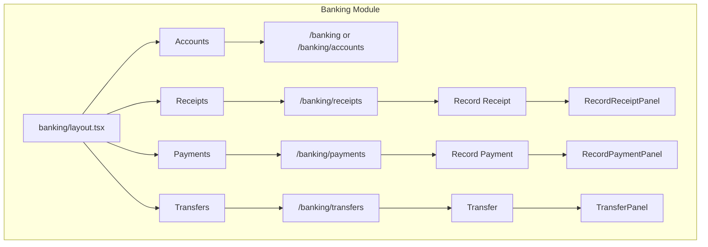
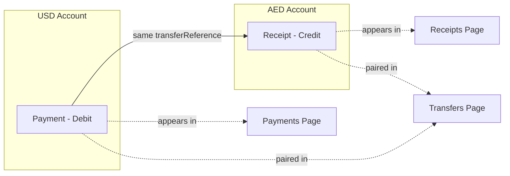
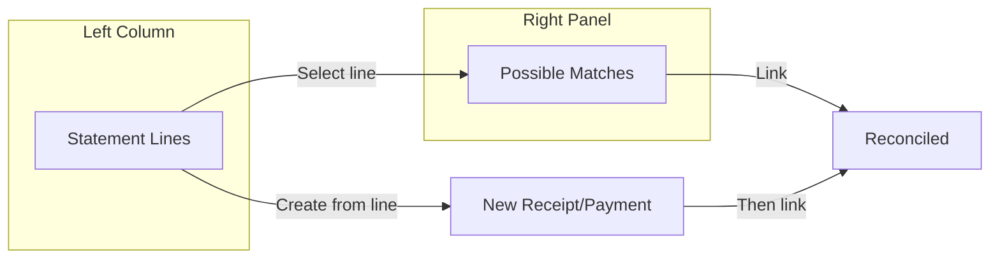

# Banking Pill Navigation and Action Panels

## Current State

- **Banking**: Single page at `[src/app/(dashboard)/banking/page.tsx](src/app/(dashboard)`/banking/page.tsx) with stats, bank account tabs, transactions table, and "Import Statement" button.
- **Sales pattern**: Layout with pills (Invoices, Customers, Payments Received, Statements); each child page has search + primary action button (e.g. "New Invoice").

## Target Structure

---

## 1. Banking Layout with Pill Navigation

**Create** `[src/app/(dashboard)/banking/layout.tsx](src/app/(dashboard)`/banking/layout.tsx)

- Mirror `[sales/layout.tsx](src/app/(dashboard)`/sales/layout.tsx) pattern.
- **Pills**: Accounts | Receipts | Payments | Inter-account Transfers
- Icons: `Landmark`, `ArrowDownLeft` (receipts), `ArrowUpRight` (payments), `ArrowLeftRight` (transfers)
- Title + pills inline; active pill: `bg-text-primary text-white`
- Breadcrumbs: Workspaces > Banking > [page title]

---

## 2. Restructure Pages

**Move current content** from `banking/page.tsx` to `banking/accounts/page.tsx` (or keep at `/banking` with redirect logic).

- `**/banking`** (or `/banking/accounts`): Bank reconciliation (2-column screen) + stats. See **Section 10: Bank Reconciliation** below. Remove Breadcrumbs/PageHeader (handled by layout).
- `**/banking/receipts`**: New page—list of receipts (payments received), search, "Record Receipt" button.
- `**/banking/payments`**: New page—list of payments made, search, "Record Payment" button.
- `**/banking/transfers`**: New page—list of inter-account transfers, "Transfer" button.

Routing choice: Use `/banking` for Accounts (default) and `/banking/receipts`, `/banking/payments`, `/banking/transfers` for sub-pages. Layout shows all 4 pills; clicking Accounts goes to `/banking`.

---

## 3. Domain Definitions

**Receipts** = All credit entries in the bank (money IN). Includes:

- Customer payments (allocate to invoices)
- Owner's deposit
- Payment refunds (from suppliers)

**Payments** = All debit entries in the bank (money OUT). Includes:

- Supplier payments (allocate to bills)
- Owner's withdrawal
- Refunds to customers

Both lists are bank-centric: `bankTransactions` with `type = 'credit'` (receipts) or `type = 'debit'` (payments), whether imported from statements or manually entered.

**Inter-account Transfers** = A **view** of entries that are part of inter-account transfers. These are the **same** transactions that appear in Receipts and Payments:

- Example: Transfer from USD account to AED account:
  - **AED account**: Receipt (credit) — "Transfer from USD" — appears in **Receipts** and is **marked** for Inter-account Transfers
  - **USD account**: Payment (debit) — "Transfer to AED" — appears in **Payments** and is **marked** for Inter-account Transfers
  - **Inter-account Transfers page**: Shows the pair as one row: Date | From (USD) | To (AED) | Amount | Reference

So transfers are not a separate record type; they are receipt + payment pairs linked by a common `transferReference`. The two `bankTransactions` appear in their respective Receipts/Payments lists with an indicator, and the Transfers page displays the paired view.

---

## 4. APIs

### Receipts (all credits)

- **GET** `/api/banking/receipts` — List `bankTransactions` where `type = 'credit'` (optionally filter by `bankAccountId`). Include linked `payment` and entity info when applicable (customer/supplier for refunds). Include `isInterAccountTransfer` flag so UI can show a badge on transfer entries (e.g. "From USD account"). Merge imported statement credits + manually recorded receipts.
- **POST** `/api/banking/receipts` — Create receipt. Body: `{ receiptType, date, bankAccountId, amount, description?, customerId?, allocations?, supplierId?, ... }`.
  - **Customer Payment**: Create `payment` (paymentType=received), allocations, update invoices, journal entry, and **bank transaction** (type=credit).
  - **Owner's Deposit**: Create `bankTransaction` (type=credit) + journal entry (dr. bank, cr. owner's equity/drawings reversal or designated account).
  - **Refund Received**: Create `payment` (paymentType=received, entityType=supplier) + optional allocation to bill credit, journal entry, `bankTransaction` (type=credit).

### Payments (all debits)

- **GET** `/api/banking/payments` — List `bankTransactions` where `type = 'debit'`. Include linked `payment` and entity info when applicable. Include `isInterAccountTransfer` flag so UI can show a badge on transfer entries.
- **POST** `/api/banking/payments` — Create payment. Body: `{ paymentType, date, bankAccountId, amount, description?, supplierId?, allocations?, customerId?, ... }`.
  - **Supplier Payment**: Create `payment` (paymentType=made), allocations, update bills, journal entry, **bank transaction** (type=debit).
  - **Owner's Withdrawal**: Create `bankTransaction` (type=debit) + journal entry (dr. owner's equity/drawings, cr. bank).
  - **Refund to Customer**: Create `payment` (paymentType=made, entityType=customer) + optional allocation to invoice credit, journal entry, `bankTransaction` (type=debit).

### Transfers (paired view)

- **GET** `/api/banking/transfers` — Return **paired** transactions: find `bankTransactions` where `category = 'inter_account_transfer'` and `transferReference` (or similar) matches. Group by pair: each row = one transfer with From Account, To Account, Amount, Date, Reference. The underlying debit and credit stay in `bankTransactions` and appear in Payments/Receipts respectively.
- **POST** `/api/banking/transfers` — Create transfer:
  - Generate a unique `transferReference` (e.g. `TRF-2026-001`).
  - Insert two `bankTransactions`:
    - Debit on from-account (USD): `description = "Transfer to AED"`, `category = 'inter_account_transfer'`, `reference = transferReference`
    - Credit on to-account (AED): `description = "Transfer from USD"`, `category = 'inter_account_transfer'`, `reference = transferReference`
  - Update `currentBalance` on both `bankAccounts`.
  - Optionally create a journal entry (dr. to-account GL, cr. from-account GL) for GL accuracy.

**Note**: `payments` and `bankTransactions` schema already exist. Add `transferReference` (varchar, nullable) to `bankTransactions` to link pairs. When both debit and credit share the same `transferReference`, they form a transfer pair. Manually recorded receipts/payments must create `bankTransactions` so they appear in the bank-centric lists.

---

## 5. Panels

### RecordReceiptPanel

**Create** `src/components/modals/record-receipt-panel.tsx`

- EntityPanel pattern (like `[CreateInvoicePanel](src/components/modals/create-invoice-panel.tsx)`).
- **Receipt type selector**: Customer Payment | Owner's Deposit | Refund Received
- Common fields: Date, Bank Account (SearchableSelect from `/api/banking`), Amount, Reference/Notes.
- **Customer Payment**: Customer (ContactSelect), Allocations to unpaid invoices (reuse UX from `[VerifyReceiptForm](src/components/documents/verify-receipt-form.tsx)`).
- **Owner's Deposit**: Description (e.g. "Capital injection").
- **Refund Received**: Supplier (ContactSelect), optional allocation to bill/credit note; Description.
- Calls `POST /api/banking/receipts` with `receiptType` and type-specific fields.
- Fetches customers, suppliers, unpaid invoices from existing APIs.

### RecordPaymentPanel (Banking)

**Create** `src/components/modals/record-payment-banking-panel.tsx`

- EntityPanel pattern.
- **Payment type selector**: Supplier Payment | Owner's Withdrawal | Refund to Customer
- Common fields: Date, Bank Account, Amount, Reference/Notes.
- **Supplier Payment**: Supplier (ContactSelect), Allocations to unpaid bills.
- **Owner's Withdrawal**: Description (e.g. "Drawings").
- **Refund to Customer**: Customer (ContactSelect), optional allocation to invoice/credit note; Description.
- Calls `POST /api/banking/payments` with `paymentType` and type-specific fields.
- Fetches suppliers, customers, unpaid bills from existing APIs.

### TransferPanel

**Create** `src/components/modals/transfer-panel.tsx`

- Fields: From Account, To Account (same org, exclude same account), Amount, Date, Reference.
- Calls `POST /api/banking/transfers`.
- Fetches bank accounts from `/api/banking`.

---

## 6. Page Implementations

### Receipts page

- Search input, "Record Receipt" button (opens RecordReceiptPanel).
- Table: Date, Bank Account, Type (Customer Payment | Owner's Deposit | Refund | **Inter-account**), Entity (customer/supplier or "From X account" for transfers or "—"), Amount, Reference.
- Show badge/indicator for rows where `isInterAccountTransfer === true` (e.g. "Inter-account" or "From USD").
- Fetch from `GET /api/banking/receipts`; empty state when no data.
- Click row to open detail overlay (optional).

### Payments page

- Search input, "Record Payment" button (opens RecordPaymentPanel).
- Table: Date, Bank Account, Type (Supplier Payment | Owner's Withdrawal | Refund | **Inter-account**), Entity, Amount, Reference.
- Show badge/indicator for rows where `isInterAccountTransfer === true` (e.g. "Inter-account" or "To AED").
- Fetch from `GET /api/banking/payments`; empty state when no data.

### Transfers page

- "Transfer" button (opens TransferPanel).
- Table: Date, From Account, To Account, Amount, Reference.
- Each row represents a **paired** transfer (the receipt in destination + payment in source). Fetch from `GET /api/banking/transfers`.
- Empty state when no transfers.

---

## 7. Schema Considerations

- **bank_statements** (new): `id`, `organizationId`, `bankAccountId`, `uploadedAt`, `fileName`, `s3Key`, `status`
- **bank_statement_lines** (new): `id`, `bankStatementId`, `transactionDate`, `description`, `amount`, `type` (credit/debit), `reference`, `matchedBankTransactionId` (nullable FK), `reconciledAt` (nullable), `lineOrder`
- **bankTransactions**:
  - `category` (existing varchar 50): Store `customer_payment`, `owner_deposit`, `refund_received`, `supplier_payment`, `owner_withdrawal`, `refund_to_customer`, `inter_account_transfer`.
  - Add `transferReference` (varchar 50, nullable): When set, this transaction is part of an inter-account transfer. Debit and credit of the same transfer share the same `transferReference`. Used to pair them for the Transfers view and to compute `isInterAccountTransfer` for Receipts/Payments lists.
- **Linked payments**: When receipt/payment is customer or supplier type, add `paymentId` on `bankTransactions` (nullable FK) for traceability. The verify route does not currently create bank transactions for receipts—we will add that.

---

## 10. Bank Reconciliation

### Concept

A 2-column screen where users match **bank statement lines** (left) to **manually recorded entries** (right). Statement uploads do **not** auto-create transactions; users reconcile by linking or by creating new records from statement lines.

### Data Model (New)

- **bank_statements**: `id`, `bankAccountId`, `organizationId`, `uploadedAt`, `fileName`, `s3Key` (or file ref), `status`
- **bank_statement_lines**: `id`, `bankStatementId`, `transactionDate`, `description`, `amount`, `type` (credit/debit), `reference`, `matchedBankTransactionId` (nullable), `reconciledAt` (nullable), `lineOrder`

**Important**: Statement import no longer creates `bankTransactions`. It creates `bank_statements` + `bank_statement_lines` only.

### 2-Column Layout

**Left column**: Uploaded bank statement lines

- Bank account selector (or use selected account from context)
- "Upload Statement" button — upload CSV/PDF, parse into `bank_statement_lines`
- Table: Date | Description | Amount | Type | Status (Matched / Unmatched)
- Click a row to select it → right panel shows possible matches
- Actions per line: "Create receipt from line" | "Create payment from line" → opens RecordReceiptPanel / RecordPaymentPanel pre-filled from statement line; after save, user can link

**Right panel**: Possible matching results (when a statement line is selected)

- Fetch unreconciled manual entries (receipts for credit lines, payments for debit lines) for that bank account
- Rank by: amount match, date proximity, description similarity (configurable thresholds)
- Display: Date | Description | Amount | Type (Customer Payment, etc.) | Match score
- Actions: "Link" (match this statement line to this entry) | "Create new" (if no good match)
- When linking: create `bankTransaction` from the statement line? Or link statement_line to existing bankTransaction? — **Link** = set `matchedBankTransactionId` on statement_line, mark both as reconciled. The statement line stays as statement line; our bankTransaction stays as is. We record the link.

### Two-Step Process per Match

1. **Bank reconciliation**: Link statement line ↔ our entry (receipt/payment/transfer). Both marked reconciled.
2. **GL categorization**: If our entry is not yet categorized (e.g. owner deposit), or for statement-created entries, user categorizes to GL account (reuse existing Suggest/Apply flow).

### Unmatched Statement Lines

- **Option A**: "Create receipt" or "Create payment" from line → creates our manual entry (bankTransaction + optional payment), pre-filled with date, amount, description. User completes details, saves. Then link.
- **Option B**: Leave as unidentified/unreconciled for later review.

### Matching Logic (Configurable)

- **Amount**: Exact or within tolerance (e.g. 0.01)
- **Date**: Within N days (e.g. ±3 days)
- **Description**: Fuzzy/similarity score (optional)
- Return candidates sorted by combined score. Expose config in settings or API params.

### APIs

- **POST** `/api/banking/statements/upload` — Upload file, parse, create `bank_statements` + `bank_statement_lines`. Does NOT create bankTransactions.
- **GET** `/api/banking/statements` — List statements for account; include line counts, reconciled counts.
- **GET** `/api/banking/statement-lines` — List lines for a statement (or account), with `matchedBankTransactionId` and reconciled status.
- **GET** `/api/banking/reconciliation/matches?statementLineId=...` — Get possible matches for a statement line. Query unreconciled receipts (if credit) or payments (if debit) for that bank account; rank by amount, date, description. Return with scores.
- **POST** `/api/banking/reconciliation/link` — Body: `{ statementLineId, bankTransactionId }`. Set `matchedBankTransactionId`, `reconciledAt` on statement line. Mark bankTransaction as reconciled.
- **POST** `/api/banking/reconciliation/create-from-line` — Body: `{ statementLineId, entryType: 'receipt'|'payment', ... }`. Create receipt or payment from statement line data, then optionally auto-link.

### Statement Upload vs Document Import

- **Banking reconciliation upload**: Creates `bank_statements` + `bank_statement_lines` only. No auto-creation of `bankTransactions`.
- **Document vault** (e.g. `/documents` with bank_statement type): Today may create `bankTransactions` via verify. Option: Redirect bank statement documents to Banking reconciliation, or use same statement tables and skip auto-creation. Scope TBD; Banking reconciliation is the primary path.

---

## 11. File Summary

| Action | Path                                                                                                             |
| ------ | ---------------------------------------------------------------------------------------------------------------- |
| Create | `src/app/(dashboard)/banking/layout.tsx`                                                                         |
| Create | `src/app/(dashboard)/banking/accounts/page.tsx` — Bank reconciliation 2-column screen + stats                    |
| Modify | `src/app/(dashboard)/banking/page.tsx` → redirect or render Accounts content                                     |
| Create | `src/app/(dashboard)/banking/receipts/page.tsx`                                                                  |
| Create | `src/app/(dashboard)/banking/payments/page.tsx`                                                                  |
| Create | `src/app/(dashboard)/banking/transfers/page.tsx`                                                                 |
| Create | `src/app/api/banking/receipts/route.ts` (GET, POST)                                                              |
| Create | `src/app/api/banking/payments/route.ts` (GET, POST)                                                              |
| Create | `src/app/api/banking/transfers/route.ts` (GET, POST)                                                             |
| Create | `src/app/api/banking/statements/upload/route.ts` (POST)                                                          |
| Create | `src/app/api/banking/statements/route.ts` (GET)                                                                  |
| Create | `src/app/api/banking/statement-lines/route.ts` (GET)                                                             |
| Create | `src/app/api/banking/reconciliation/matches/route.ts` (GET)                                                      |
| Create | `src/app/api/banking/reconciliation/link/route.ts` (POST)                                                        |
| Create | `src/app/api/banking/reconciliation/create-from-line/route.ts` (POST)                                            |
| Create | `src/components/modals/record-receipt-panel.tsx`                                                                 |
| Create | `src/components/modals/record-payment-banking-panel.tsx`                                                         |
| Create | `src/components/modals/transfer-panel.tsx`                                                                       |
| Create | `src/components/banking/reconciliation-two-column.tsx` — Left: statement lines, Right: matches panel             |
| Schema | Add `bank_statements`, `bank_statement_lines` tables; add `transferReference`, `paymentId` to `bankTransactions` |

---

## 12. Routing and Default View

- Top nav links to `/banking` → show Accounts (current reconciliation) by default.
- Pills: Accounts (href `/banking`), Receipts (`/banking/receipts`), Payments (`/banking/payments`), Transfers (`/banking/transfers`).
- `page.tsx` at `/banking` can either re-export the Accounts content or redirect to `/banking/accounts`; layout wraps all.

