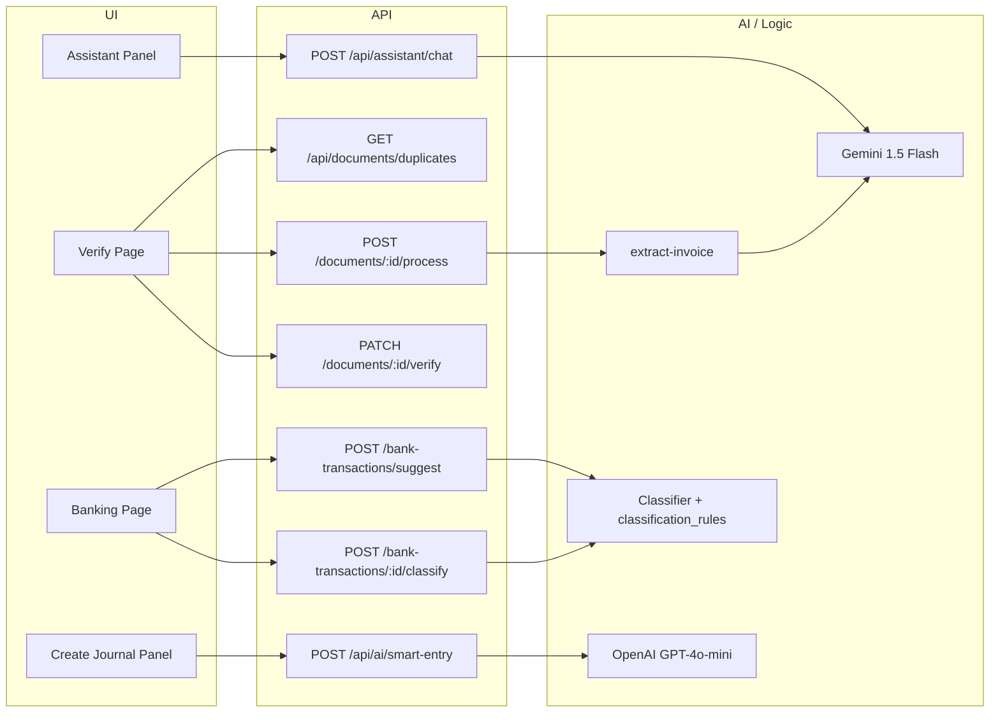

# Next Steps to Fully Implement and Connect AI Agents

## Current state

**Already connected:**

- **Document extraction (Gemini 1.5 Flash)** – [extract-invoice.ts](accounting-ai/src/lib/ai/extract-invoice.ts) uses real Gemini with UAE invoice prompt, Zod validation, and math guard. No mock.
- **Process pipeline** – [POST /api/documents/[id]/process](accounting-ai/src/app/api/documents/[id]/process/route.ts) checks tokens/archive, fetches from S3, runs extraction, updates document, decrements `tokenBalance`, and writes audit log.
- **Verify pipeline** – [PATCH /api/documents/[id]/verify](accounting-ai/src/app/api/documents/[id]/verify/route.ts) moves file to retention vault, creates `document_transactions`, creates journal entry + lines (expense, VAT input, AP), upserts `merchant_maps`, and logs audit. GL prediction is resolved to `chart_of_accounts.id` on the verify page for pre-fill.
- **VAT 201** – [GET /api/reports/vat-201](accounting-ai/src/app/api/reports/vat-201/route.ts) returns box-level data from `documentTransactions`, invoices, and bills.
- **Schema** – `documents`, `document_transactions`, `merchant_maps`, `organizations.tokenBalance` / `subscriptionPlan` exist and are used.

**Not yet connected:**

- **AI Assistant panel** – Still mock: hardcoded responses in [assistant-panel.tsx](accounting-ai/src/components/ai/assistant-panel.tsx) and a generic fallback; no backend call.
- **Smart entry bar (NL → structured transaction)** – Referenced in Main Plans (OpenAI GPT-4o-mini) but no `nl-parser` or API in the codebase.
- **Bank classification** – `classification_rules` table exists in [schema.ts](accounting-ai/src/lib/db/schema.ts); no classifier/rules-engine or API that suggests GL for bank transactions or learns from corrections.
- **Duplicate detection** – Verify page uses mock logic (“In production, this would be an API call”); no server-side duplicate check.

---

## 1. Connect the AI Assistant panel to a real chat API

**Goal:** Replace mock responses with a live AI that can answer accounting questions in context, with token metering.

**Implementation:**

- Add **POST /api/assistant/chat** (or `/api/ai/chat`):
  - Accept `{ message: string }` (and optionally `context?: { pathname, entityId }`).
  - Resolve `organizationId` from session; enforce `tokenBalance >= 0.1` (or 1 if you use whole tokens); return 402 if insufficient.
  - Call **Gemini** (or OpenAI) with a system prompt that describes the app (UAE accounting, documents, VAT, invoices, bank reconciliation) and optional context (e.g. “User is on /sales”).
  - Parse response and return `{ reply: string }` (or stream).
  - Decrement `organizations.tokenBalance` by 0.1 (or 1) on success; log to `audit_logs` (e.g. `action: "assistant_query"`).
- In [assistant-panel.tsx](accounting-ai/src/components/ai/assistant-panel.tsx):
  - Replace `handleQuery` so it calls this API instead of `aiResponses[query]` and the generic fallback.
  - Keep suggestion chips as shortcuts that send the same query to the API; show loading and errors (e.g. “Out of tokens” / upgrade CTA when 402).

**Design choice:** Use Gemini (already in use for extraction) for consistency and one key, or OpenAI as in Main Plans; either way, document the choice and add the corresponding env var (e.g. `OPENAI_API_KEY` if used).

---

## 2. Smart entry bar (natural language → structured transaction)

**Goal:** Let users type a sentence (e.g. “Office supplies 500 AED from ACE”) and get a structured journal entry suggestion, per Main Plans.

**Implementation:**

- Add **lib/ai/nl-parser.ts** (or **lib/ai/smart-entry.ts**):
  - Call **OpenAI GPT-4o-mini** (as in Main Plans) with a strict prompt + structured output (e.g. JSON: `{ date, lines: [{ accountCodeOrName, debit, credit, description }] }`). Map to your CoA (e.g. UAE codes) so the result references valid accounts.
- Add **POST /api/ai/smart-entry** (or under journal):
  - Body: `{ nl: string }`.
  - Resolve org; optionally check tokens and decrement (if you meter smart entry).
  - Call nl-parser; resolve returned account codes/names to `chart_of_accounts.id` for current org.
  - Return `{ suggestedEntry: { date, lines: [{ accountId, accountCode, name, debit, credit, description }] } }` for the UI to pre-fill or confirm.
- Wire the **create journal entry** UI (e.g. [create-journal-entry-panel.tsx](accounting-ai/src/components/modals/create-journal-entry-panel.tsx)) to an input that sends `nl` to this API and pre-fills the form (or show a confirmation step before posting).

**Dependency:** Ensure OpenAI SDK and `OPENAI_API_KEY` are available.

---

## 3. Bank classification (rule-based + learning)

**Goal:** Suggest GL for bank transactions using rules and per-org learning, and feed corrections back into learning (Main Plans Sprint 6).

**Implementation:**

- Add **lib/ai/classifier.ts** (and optionally **lib/ai/rules-engine.ts**):
  - **Input:** Bank transaction line (description, amount, date, merchant if available).
  - **Rules:** Pattern matching (keywords, merchant substrings) against a small rule set that maps to GL account codes. Use `classification_rules` for the org to apply learned overrides first (e.g. “STARBUCKS” → 6400).
  - **Output:** Suggested `gl_account_id` (or code) and confidence (e.g. 0–1). If no rule matches, return null or a default “Uncategorized” account.
- Add **POST /api/bank-transactions/suggest** (or GET with query params):
  - Body or params: transaction description, amount, optional merchant.
  - Return `{ suggestedGlAccountId, suggestedGlCode, confidence }` for the current org.
- **Learning:** When the user confirms or changes a classification on the banking reconciliation UI, call an API (e.g. **POST /api/bank-transactions/:id/classify** or **PATCH** with `glAccountId`) that:
  - Saves or updates a row in `classification_rules` (e.g. pattern from description/merchant → `gl_account_id`) so future suggestions use it.
- Wire the **banking page** ([banking/page.tsx](accounting-ai/src/app/(dashboard)/banking/page.tsx)) to:
  - Show “Suggest GL” (or auto-suggest) using the suggest API.
  - On user apply/correct, call the classify API to persist learning.

**Note:** Main Plans use “rule-based + learning”; no LLM is required for this agent if you keep it pattern + `classification_rules` only. You can later add an optional LLM pass for ambiguous lines.

---

## 4. Real duplicate detection for documents

**Goal:** Replace the mock duplicate check on the verify page with a server-side check so users see real potential duplicates before verifying.

**Implementation:**

- Add **GET /api/documents/duplicates** (or include duplicate candidates in **GET /api/documents/[id]** response):
  - Query params or body: `merchantName`, `amount`, `date` (or `documentId` and derive from document).
  - Search `document_transactions` (and optionally `documents`) for the same org with similar merchant (e.g. normalized name), same or very close amount, and date within a window (e.g. ±7 days). Return a list of `{ documentId, merchantName, amount, date, similarity }`.
- On the **verify page**, when loading the document, call this API with the extracted merchant and amount (and date); display results in the existing [DuplicateWarning](accounting-ai/src/components/ai/duplicate-warning.tsx) component instead of the hardcoded Gulf/15750 mock.

---

## 5. Optional improvements (from MVP plan)

- **Token refill:** Implement periodic refill (e.g. monthly reset to plan limit 50/300/1000) and show upgrade CTA when balance is 0 (already partially in place via 402 from process API).
- **PDF for Gemini:** Current code sends PDF bytes with `mimeType: "application/pdf"`; Gemini 1.5 supports PDF. If you hit limits or quality issues, add a step to convert PDF pages to images and send the first (or all) pages.
- **Audit:** Assistant and smart-entry flows should write to `audit_logs` (e.g. `assistant_query`, `smart_entry_used`) for compliance and support.

---

## Suggested order of work

| Priority | Item                                                        | Effort |
| -------- | ----------------------------------------------------------- | ------ |
| 1        | Assistant chat API + wire panel                             | Medium |
| 2        | Duplicate detection API + wire verify page                  | Small  |
| 3        | Bank classifier + suggest/classify APIs + wire banking page | Medium |
| 4        | Smart entry (nl-parser + API + wire journal UI)             | Medium |

This order connects the visible “AI” surfaces first (assistant, duplicates), then adds the two Main Plans agents (bank classification, smart entry).

---

## Architecture snapshot (after AI agents are connected)

---

## Key files to add or extend

| Area                                                                                                                                     | Action                                                            |
| ---------------------------------------------------------------------------------------------------------------------------------------- | ----------------------------------------------------------------- |
| [accounting-ai/src/components/ai/assistant-panel.tsx](accounting-ai/src/components/ai/assistant-panel.tsx)                               | Call real chat API; remove mock map; handle 402 and errors        |
| New: `app/api/assistant/chat/route.ts` (or `api/ai/chat`)                                                                                | Chat endpoint with Gemini/OpenAI and token decrement              |
| New: `lib/ai/nl-parser.ts` or `lib/ai/smart-entry.ts`                                                                                    | OpenAI structured call for NL → journal suggestion                |
| New: `app/api/ai/smart-entry/route.ts`                                                                                                   | Smart entry endpoint; resolve accounts and return suggested entry |
| New: `lib/ai/classifier.ts` (and optionally `rules-engine.ts`)                                                                           | Rule-based + classification_rules for bank GL suggestion          |
| New: `app/api/bank-transactions/suggest/route.ts`                                                                                        | Suggest GL for a bank line                                        |
| New or extend: bank-transactions classify API                                                                                            | Persist user correction to classification_rules                   |
| [accounting-ai/src/app/(dashboard)/banking/page.tsx](accounting-ai/src/app/(dashboard)/banking/page.tsx)                                 | Use suggest/classify and show “Suggest GL” / learning             |
| New: `app/api/documents/duplicates/route.ts` (or in GET document by id)                                                                  | Return duplicate candidates by merchant/amount/date               |
| [accounting-ai/src/app/(dashboard)/documents/[id]/verify/page.tsx](accounting-ai/src/app/(dashboard)/documents/[id]/verify/page.tsx)     | Fetch duplicates from API and pass to DuplicateWarning            |
| [accounting-ai/src/components/modals/create-journal-entry-panel.tsx](accounting-ai/src/components/modals/create-journal-entry-panel.tsx) | Add smart entry input and wire to smart-entry API                 |

Once these are in place, all planned AI agents (document extraction, assistant chat, smart entry, bank classification) are implemented and connected end-to-end, with duplicate detection backed by real data.