# Transaction Persistence Audit and Fix Plan

## Audit Findings Summary

### Root Causes Identified

1. **Fetch caching** — Client-side `fetch("/api/banking")` and similar GETs can return cached responses after mutations, so newly created data does not appear until cache expires. After sign-out/sign-in, a fresh load may still hit cache depending on browser behavior.
2. **Client-only create flows** — Five create/add flows never call an API; they only update React state. Data is lost on refresh or navigation.
3. **Org context edge case** — If sign-out clears the `current_org_id` cookie (or user clears cookies manually), the user lands on onboarding and may create a new org. Data created in the previous org would not be visible.

---

## Category A: Fix Fetch Caching (Bank Accounts + Similar)

**Problem:** `fetch("/api/...")` without `cache: "no-store"` may return stale data after create/update/delete.

**Files to update:**

| File | Change |
|------|--------|
| [src/app/(dashboard)/banking/page.tsx](src/app/(dashboard)/banking/page.tsx) | Line 41: `fetch("/api/banking", { cache: "no-store" })` |
| [src/app/(dashboard)/banking/accounts/page.tsx](src/app/(dashboard)/banking/accounts/page.tsx) | `refreshBanking`: `fetch("/api/banking", { cache: "no-store" })` |
| All pages that fetch after mutations | Audit and add `cache: "no-store"` to any GET that must reflect recent changes |

**Pattern:** For any `fetch` used to refresh data after a mutation (create, update, delete), add `{ cache: "no-store" }` to avoid stale responses.

**Additional fetch locations to audit:**
- [src/app/(dashboard)/sales/invoices/page.tsx](src/app/(dashboard)/sales/invoices/page.tsx) — `fetch("/api/sales/invoices")`, `fetch("/api/sales/customers")`
- [src/app/(dashboard)/purchases/bills/page.tsx](src/app/(dashboard)/purchases/bills/page.tsx) — invoices, bills, suppliers
- [src/app/(dashboard)/inventory/page.tsx](src/app/(dashboard)/inventory/page.tsx) — `fetch("/api/inventory")`
- [src/app/(dashboard)/sales/payments/page.tsx](src/app/(dashboard)/sales/payments/page.tsx) — invoices, payments
- [src/app/(dashboard)/accounting/journal-entries/page.tsx](src/app/(dashboard)/accounting/journal-entries/page.tsx) — entries
- Documents page, dashboard stats, etc.

---

## Category B: Wire Create Flows to Persist to Database

**Problem:** These flows only update local state; no API call, so nothing is saved.

### 1. Create Invoice

| Component | Current behavior | Fix |
|-----------|------------------|-----|
| [src/app/(dashboard)/sales/invoices/page.tsx](src/app/(dashboard)/sales/invoices/page.tsx) | `handleCreateInvoice` → `setInvoices([newInv, ...prev])` | Call POST API, then refresh or optimistically update |
| [src/app/api/sales/invoices/route.ts](src/app/api/sales/invoices/route.ts) | GET only | Add POST handler with `db.insert(invoices)`, `db.insert(invoiceLines)` |

**Schema:** `invoices`, `invoiceLines` exist in [src/lib/db/schema.ts](src/lib/db/schema.ts).

### 2. Create Bill

| Component | Current behavior | Fix |
|-----------|------------------|-----|
| [src/app/(dashboard)/purchases/bills/page.tsx](src/app/(dashboard)/purchases/bills/page.tsx) | `handleCreate` → `setBills([newBill, ...prev])` | Call POST API |
| [src/app/api/purchases/bills/route.ts](src/app/api/purchases/bills/route.ts) | GET only | Add POST handler with `db.insert(bills)`, `db.insert(billLines)` |

### 3. Record Payment (Sales — Customer Payment)

| Component | Current behavior | Fix |
|-----------|------------------|-----|
| [src/app/(dashboard)/sales/payments/page.tsx](src/app/(dashboard)/sales/payments/page.tsx) | `handleCreate` → `setPayments([...])` | Call POST API |
| [src/components/modals/record-payment-panel.tsx](src/components/modals/record-payment-panel.tsx) | Invokes `onCreate` only | API already exists: `POST /api/banking/receipts` with `receiptType: "customer_payment"` |

**Note:** Banking receipts API already handles customer payments. The Sales payments page uses `RecordPaymentPanel`, which only calls `onCreate` with client state. Refactor to call `POST /api/banking/receipts` (or a dedicated sales payments endpoint) and then refresh invoices/payments.

### 4. Add Inventory Item

| Component | Current behavior | Fix |
|-----------|------------------|-----|
| [src/app/(dashboard)/inventory/page.tsx](src/app/(dashboard)/inventory/page.tsx) | `handleCreate` → `setItems([newItem, ...prev])` | Call POST API |
| [src/app/api/inventory/route.ts](src/app/api/inventory/route.ts) | **POST exists** | Frontend does not use it — wire `handleCreate` to `fetch("/api/inventory", { method: "POST", ... })` |

### 5. Create Journal Entry

| Component | Current behavior | Fix |
|-----------|------------------|-----|
| [src/app/(dashboard)/accounting/journal-entries/page.tsx](src/app/(dashboard)/accounting/journal-entries/page.tsx) | `handleCreate` → `setEntries([...])` | Call POST API |
| [src/app/api/accounting/](src/app/api/accounting/) | Check for journal-entry route | Add POST handler for journal entries and lines if missing |

---

## Category C: Org Cookie Robustness (Optional)

**Problem:** If `current_org_id` is cleared on sign-out (e.g. user clears cookies), the user may go through onboarding again and create a new org. Data from the previous org will not be visible.

**Recommendation:** On sign-in (or when loading the app), if the user has exactly one organization and no org cookie, auto-set the cookie. This can be done in middleware or in a post-auth redirect. Lower priority than A and B.

---

## Implementation Order

1. **Category A** — Add `cache: "no-store"` to banking and other mutation-adjacent fetches (quick, high impact for bank accounts).
2. **Category B.4** — Wire inventory `handleCreate` to existing `POST /api/inventory` (API exists; frontend change only).
3. **Category B.1 & B.2** — Add POST handlers for invoices and bills, then wire frontend.
4. **Category B.3** — Refactor RecordPaymentPanel (Sales) to call banking receipts API or a sales-payments endpoint.
5. **Category B.5** — Add journal entry POST API and wire frontend.
6. **Category C** — Org cookie restoration (if desired).

---

## Data Flow (Current vs Fixed)

```mermaid
flowchart TB
    subgraph current [Current - Bank Account]
        A1[User creates account]
        A2[POST /api/banking/accounts]
        A3[DB insert succeeds]
        A4[refreshBanking - fetch GET]
        A5[Cache returns old data]
        A6[UI shows no new account]
        A1 --> A2 --> A3
        A3 --> A4 --> A5 --> A6
    end

    subgraph fixed [Fixed]
        B1[User creates account]
        B2[POST /api/banking/accounts]
        B3[DB insert succeeds]
        B4[refreshBanking - fetch with no-store]
        B5[Fresh data from DB]
        B6[UI shows new account]
        B1 --> B2 --> B3
        B3 --> B4 --> B5 --> B6
    end
```

---

## Flows That Already Persist (No Change Needed)

- Add Customer, Add Supplier, Create Contact, Create Product — call APIs and persist.
- Record Receipt, Record Payment (Banking), Inter-account Transfer — persist.
- Add Bank Account — persists; fix is caching only.
- Document verify (all types) — persists via PATCH `/api/documents/[id]/verify`.
